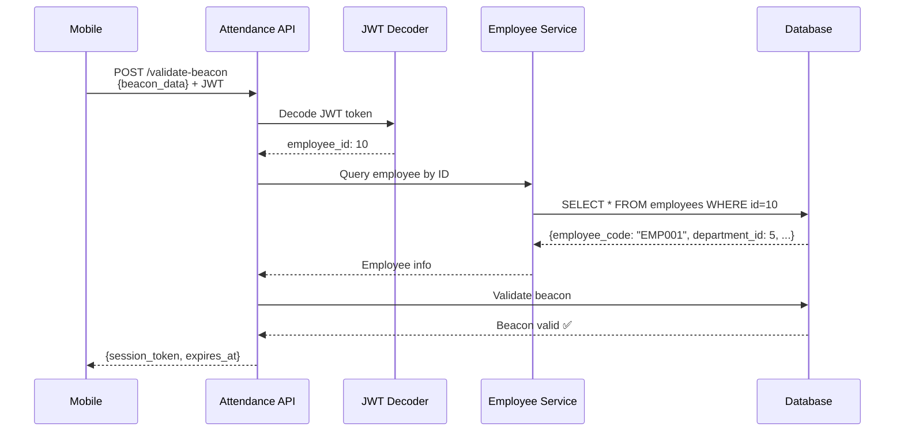

# ⚠️ QUAN TRỌNG: Backend Auto-Fetch Employee Info

## 📋 Tóm tắt

**Client KHÔNG CẦN gửi `employee_id`, `employee_code`, `department_id` trong request body!**

Backend tự động xử lý:
1. Extract `employee_id` từ JWT token
2. Query Employee Service để lấy `employee_code` và `department_id`
3. Validate và process request

---

## 🔐 JWT Token Structure

**Sau khi login, JWT token có cấu trúc:**

```json
{
  "sub": "7",                // account_id
  "employee_id": "10",       // ✅ QUAN TRỌNG - Employee ID
  "email": "admin@gmail.com",
  "role": "ADMIN",
  "permissions": ["attendance.checkin", "..."],
  "iat": 1763795867,
  "exp": 1763796767
}
```

**Lưu ý:**
- JWT token CHỈ CÓ `employee_id`
- JWT token KHÔNG CÓ `employee_code` và `department_id`

---

## ✅ Cách gọi API đúng

### ❌ TRƯỚC (SAI - Không làm thế này nữa)

```http
POST /api/v1/attendance/attendance-check/validate-beacon
Authorization: Bearer {JWT_TOKEN}
Content-Type: application/json

{
  "employee_id": 123,           ❌ KHÔNG GỬI
  "employee_code": "EMP001",    ❌ KHÔNG GỬI
  "beacon_uuid": "FDA50693-A4E2-4FB1-AFCF-C6EB07647825",
  "beacon_major": 1,
  "beacon_minor": 100,
  "rssi": -65
}
```

### ✅ SAU (ĐÚNG - Làm như này)

```http
POST /api/v1/attendance/attendance-check/validate-beacon
Authorization: Bearer {JWT_TOKEN}
Content-Type: application/json

{
  "beacon_uuid": "FDA50693-A4E2-4FB1-AFCF-C6EB07647825",
  "beacon_major": 1,
  "beacon_minor": 100,
  "rssi": -65
}
```

**Backend tự động:**
1. ✅ Lấy `employee_id` từ JWT token
2. ✅ Query Employee Service: `employee_code`, `department_id`
3. ✅ Validate beacon

---

## 📝 So sánh Request Body

### 1️⃣ Validate Beacon

| Field | ❌ Trước | ✅ Sau | Lý do |
|-------|---------|--------|-------|
| `employee_id` | ✅ Bắt buộc | ❌ Không gửi | Backend lấy từ JWT |
| `employee_code` | ✅ Bắt buộc | ❌ Không gửi | Backend query từ DB |
| `beacon_uuid` | ✅ Bắt buộc | ✅ Bắt buộc | Client scan beacon |
| `beacon_major` | ✅ Bắt buộc | ✅ Bắt buộc | Client scan beacon |
| `beacon_minor` | ✅ Bắt buộc | ✅ Bắt buộc | Client scan beacon |
| `rssi` | ✅ Bắt buộc | ✅ Bắt buộc | Signal strength |

### 2️⃣ Request Face Verification

| Field | ❌ Trước | ✅ Sau | Lý do |
|-------|---------|--------|-------|
| `employee_id` | ✅ Bắt buộc | ❌ Không gửi | Backend lấy từ JWT |
| `employee_code` | ✅ Bắt buộc | ❌ Không gửi | Backend query từ DB |
| `department_id` | ✅ Bắt buộc | ❌ Không gửi | Backend query từ DB |
| `session_token` | ✅ Bắt buộc | ✅ Bắt buộc | From beacon validation |
| `check_type` | ✅ Bắt buộc | ✅ Bắt buộc | "check_in" / "check_out" |
| `shift_date` | ✅ Bắt buộc | ✅ Bắt buộc | Current date |
| `latitude` | ⚠️ Khuyến nghị | ⚠️ Khuyến nghị | GPS location |
| `longitude` | ⚠️ Khuyến nghị | ⚠️ Khuyến nghị | GPS location |
| `location_accuracy` | ⬜ Optional | ⬜ Optional | GPS accuracy |
| `device_id` | ⬜ Optional | ⬜ Optional | Device identifier |
| `ip_address` | ⬜ Optional | ⬜ Optional | Auto-detected |

---

## 🔄 Backend Flow



---

## 📚 Tài liệu chi tiết

- **API Sequence:** `docs/CLIENT_API_SEQUENCE.md`
- **Attendance Flow:** `docs/CLIENT_ATTENDANCE_FLOW.md`
- **GPS Webhook:** `docs/CLIENT_GPS_WEBHOOK_SETUP.md`

---

## 🚨 Checklist cho Frontend Dev

- [ ] **Xóa** tất cả code gửi `employee_id` trong request body
- [ ] **Xóa** tất cả code gửi `employee_code` trong request body  
- [ ] **Xóa** tất cả code gửi `department_id` trong request body
- [ ] **Giữ** JWT token trong Authorization header
- [ ] **Test** lại tất cả API với request body mới
- [ ] **Verify** Swagger docs tại: http://3.27.15.166:32527/api/docs

---

## ❓ FAQ

**Q: Tại sao không gửi employee info nữa?**
A: Vì JWT token đã có `employee_id`, backend tự động query thông tin còn lại để đảm bảo data integrity và security.

**Q: JWT token có employee_code và department_id không?**
A: KHÔNG! JWT token chỉ có `employee_id`. Backend tự động query 2 field còn lại.

**Q: Client có cần gọi Employee API để lấy info không?**
A: KHÔNG cần cho attendance flow. Backend tự động xử lý. Chỉ gọi nếu cần hiển thị info trong UI.

**Q: Nếu employee_id trong JWT không tồn tại trong DB thì sao?**
A: Backend sẽ trả về HTTP 401 Unauthorized với message "Employee not found".

---

## 📞 Support

Nếu có vấn đề, check:
1. JWT token có field `employee_id` không? (decode để xem)
2. Request body có đúng format không? (không có employee fields)
3. Authorization header có đúng format không? (`Bearer {token}`)
4. Production URL: http://3.27.15.166:32527/

**Swagger UI:** http://3.27.15.166:32527/api/docs
