# 📱 Client Attendance Check Flow - Mobile Integration Guide

## 🎯 Overview

Tài liệu này mô tả chi tiết luồng chấm công từ phía **Mobile Client** (Flutter), bao gồm:
1. **Beacon Validation** (Bluetooth proximity check)
2. **GPS Validation** (Location geofencing)
3. **Face Recognition** (AI-powered face verification)
4. **Webhook Integration** (Background GPS tracking)

> **⚠️ QUAN TRỌNG:** 
> - Client **CHỈ GỬI JWT TOKEN**, KHÔNG gửi `employee_id`, `employee_code`, `department_id`
> - Backend tự động extract `employee_id` từ JWT token và query Employee Service để lấy thông tin đầy đủ

### 🌐 Production Environment

**Base URL:** `http://3.27.15.166:32527`

**API Endpoints:**
- Attendance Service: `http://3.27.15.166:32527/api/v1/attendance`
- Face Recognition: `http://3.27.15.166:32527/api/face-id`
- Swagger Docs: `http://3.27.15.166:32527/api/docs`

**📖 Quick Reference:** [CLIENT_API_SEQUENCE.md](./CLIENT_API_SEQUENCE.md) - Detailed API call sequence with examples

---

## 📋 Table of Contents

1. [Architecture Overview](#architecture-overview)
2. [Step-by-Step Attendance Flow](#step-by-step-attendance-flow)
3. [API Endpoints](#api-endpoints)
4. [Event-Driven Architecture](#event-driven-architecture)
5. [GPS Webhook Setup](#gps-webhook-setup)
6. [Mobile Implementation Guide](#mobile-implementation-guide)
7. [Error Handling](#error-handling)
8. [Security Considerations](#security-considerations)

---

## 🏗️ Architecture Overview

```mermaid
sequenceDiagram
    participant Mobile as 📱 Mobile App
    participant Beacon as 📡 BLE Beacon
    participant AttSvc as 🎯 Attendance Service
    participant FaceSvc as 🤖 Face Recognition
    participant NotifSvc as 🔔 Notification Service
    participant RMQ as 🐰 RabbitMQ

    Note over Mobile,RMQ: 1️⃣ BEACON VALIDATION PHASE
    Mobile->>Beacon: Scan nearby beacons
    Beacon-->>Mobile: UUID, Major, Minor, RSSI
    Mobile->>AttSvc: POST /attendance-check/validate-beacon
    AttSvc-->>Mobile: ✅ session_token (5 min TTL)

    Note over Mobile,RMQ: 2️⃣ GPS VALIDATION PHASE (Optional)
    Mobile->>Mobile: Get GPS coordinates
    Mobile->>AttSvc: Include GPS in next request
    AttSvc->>AttSvc: Validate distance <= 500m

    Note over Mobile,RMQ: 3️⃣ FACE VERIFICATION PHASE
    Mobile->>AttSvc: POST /attendance-check/request-face-verification<br/>(session_token + GPS)
    AttSvc->>AttSvc: Create attendance_check record
    AttSvc->>RMQ: Publish face_verification_requested
    AttSvc-->>Mobile: ⏳ attendance_check_id (pending)

    Mobile->>Mobile: Capture face image
    Mobile->>FaceSvc: POST /api/face-id/attendance/verify<br/>(multipart/form-data)
    FaceSvc->>FaceSvc: AI Processing (MTCNN + FaceNet)
    FaceSvc->>FaceSvc: Compare embedding (threshold >= 0.85)
    FaceSvc->>RMQ: Publish face_verification_completed
    
    RMQ->>AttSvc: Consume face_verification_completed
    AttSvc->>AttSvc: Update attendance_check record
    AttSvc->>AttSvc: Update employee_shift (check_in_time)
    AttSvc->>RMQ: Publish attendance.checked event

    RMQ->>NotifSvc: Consume attendance.checked
    NotifSvc->>Mobile: 🔔 Push: "Check-in successful!"
```



---

## 🚀 Step-by-Step Attendance Flow

### **Phase 1: Beacon Validation** ✅

#### 1.1. Mobile scans for nearby Bluetooth beacons

```dart
// Flutter example using flutter_beacon package
import 'package:flutter_beacon/flutter_beacon.dart';

Future<Beacon?> scanNearbyBeacons() async {
  final regions = [
    Region(
      identifier: 'office-beacons',
      proximityUUID: 'FDA50693-A4E2-4FB1-AFCF-C6EB07647825',
    ),
  ];

  await flutterBeacon.ranging(regions).listen((result) {
    if (result.beacons.isNotEmpty) {
      final beacon = result.beacons.first;
      print('Found beacon: UUID=${beacon.proximityUUID}, '
            'Major=${beacon.major}, Minor=${beacon.minor}, '
            'RSSI=${beacon.rssi}');
      return beacon;
    }
  });
}
```

#### 1.2. Call Beacon Validation API

**Endpoint:**
```
POST http://3.27.15.166:32527/api/v1/attendance/attendance-check/validate-beacon
```

**Request:**
```http
POST /api/v1/attendance/attendance-check/validate-beacon
Authorization: Bearer {JWT_TOKEN}
Content-Type: application/json

{
  "beacon_uuid": "FDA50693-A4E2-4FB1-AFCF-C6EB07647825",
  "beacon_major": 1,
  "beacon_minor": 100,
  "rssi": -65
}
```

> **� Backend tự động:**
> 1. Extract `employee_id` từ JWT token
> 2. Query Employee Service để lấy `employee_code` và `department_id`
> 3. Validate beacon và return session token
>
> **⚠️ Client CHỈ GỬI beacon data + JWT token!**

**Response (Success):**
```json
{
  "success": true,
  "beacon_validated": true,
  "beacon_id": 5,
  "location_name": "Building A - Floor 1",
  "distance_meters": 3.2,
  "session_token": "beacon_sess_123_5_1732252800000",
  "expires_at": "2025-11-22T07:05:00.000Z",
  "message": "Beacon validated successfully at Building A - Floor 1. You have 5 minutes to complete face verification."
}
```

**⚠️ Important:**
- `session_token` có **thời hạn 5 phút**
- Phải dùng token này trong bước tiếp theo
- RSSI threshold: `-80 dBm` (configurable per beacon)

---

### **Phase 2: GPS Validation** 📍 (Optional but Recommended)

#### 2.1. Get GPS Coordinates

```dart
import 'package:geolocator/geolocator.dart';

Future<Position> getCurrentLocation() async {
  bool serviceEnabled = await Geolocator.isLocationServiceEnabled();
  if (!serviceEnabled) {
    throw Exception('Location services are disabled');
  }

  LocationPermission permission = await Geolocator.checkPermission();
  if (permission == LocationPermission.denied) {
    permission = await Geolocator.requestPermission();
  }

  return await Geolocator.getCurrentPosition(
    desiredAccuracy: LocationAccuracy.high,
  );
}
```

#### 2.2. Include GPS in Face Verification Request

GPS data sẽ được gửi kèm theo trong **Phase 3** (không có endpoint riêng).

**Backend Logic:**
```typescript
// Attendance Service validates GPS
const gpsResult = validateGpsUseCase.execute({
  latitude: 10.762622,
  longitude: 106.660172,
  location_accuracy: 15, // meters
  office_latitude: 10.762622,
  office_longitude: 106.660172,
  max_distance_meters: 500, // Configurable
});

// Returns:
// - is_valid: true/false
// - distance_from_office_meters: number
// - message: string
```

**GPS Validation Rules:**
- ✅ **Valid**: Distance <= 500m AND accuracy <= 50m
- ❌ **Invalid**: Distance > 500m OR accuracy > 50m
- ⚠️ **Warning**: 500m < distance <= 1000m (needs approval)

---

### **Phase 3: Face Verification** 🤖

#### 3.1. Request Face Verification (Trigger Backend)

**Endpoint:**
```
POST http://3.27.15.166:32527/api/v1/attendance/attendance-check/request-face-verification
```

**Request:**
```http
POST /api/v1/attendance/attendance-check/request-face-verification
Authorization: Bearer {JWT_TOKEN}
Content-Type: application/json

{
  "session_token": "beacon_sess_123_5_1732252800000",
  "check_type": "check_in",
  "shift_date": "2025-11-22",
  "latitude": 10.762622,
  "longitude": 106.660172,
  "location_accuracy": 15,
  "device_id": "android-device-abc123",
  "ip_address": "192.168.1.100"
}
```

> **� Backend tự động:**
> 1. Extract `employee_id` từ JWT token
> 2. Query Employee Service để lấy `employee_code` và `department_id`
> 3. Create attendance check record và publish RabbitMQ event
>
> **⚠️ Client CHỈ GỬI session_token + metadata + JWT token!**

**Response:**
```json
{
  "success": true,
  "attendance_check_id": 456,
  "shift_id": 789,
  "message": "Check-in initiated. Beacon: ✅ | GPS: ✅ | Face: ⏳ (pending verification)"
}
```

**⚠️ Backend Creates:**
1. `attendance_check` record với status `pending`
2. Publishes RabbitMQ event: `face_verification_requested`
3. Returns `attendance_check_id` để mobile track

---

#### 3.2. Capture Face Image & Upload

**Request:**
```http
POST https://face-recognition-service/api/face-id/attendance/verify
Content-Type: multipart/form-data

AttendanceCheckId: 456
EmployeeId: 123
EmployeeCode: EMP001
CheckType: check_in
FaceImage: [FILE BINARY]
```

**Flutter Example:**
```dart
import 'package:http/http.dart' as http;
import 'package:image_picker/image_picker.dart';

Future<void> uploadFaceImage({
  required int attendanceCheckId,
  required int employeeId,
  required String employeeCode,
  required String checkType,
  required File imageFile,
}) async {
  var request = http.MultipartRequest(
    'POST',
    Uri.parse('https://your-domain/api/face-id/attendance/verify'),
  );

  request.fields['AttendanceCheckId'] = attendanceCheckId.toString();
  request.fields['EmployeeId'] = employeeId.toString();
  request.fields['EmployeeCode'] = employeeCode;
  request.fields['CheckType'] = checkType;

  request.files.add(
    await http.MultipartFile.fromPath('FaceImage', imageFile.path),
  );

  var response = await request.send();
  var responseBody = await response.stream.bytesToString();
  
  print('Response: $responseBody');
}
```

**Response:**
```json
{
  "success": true,
  "faceVerified": true,
  "faceConfidence": 0.92,
  "message": "Face verified successfully with 92.0% confidence"
}
```

---

#### 3.3. Backend Event Flow (Automatic)

**Face Recognition Service → RabbitMQ:**
```json
{
  "event": "face_verification_completed",
  "payload": {
    "attendance_check_id": 456,
    "employee_id": 123,
    "employee_code": "EMP001",
    "face_verified": true,
    "face_confidence": 0.92,
    "verification_time": "2025-11-22T07:01:30.000Z"
  }
}
```

**Attendance Service consumes event:**
```typescript
@EventPattern('face_verification_completed')
async handleFaceVerificationResult(@Payload() event: FaceVerificationResultEvent) {
  // 1. Update attendance_check record
  await attendanceCheckRepository.updateFaceVerification(event.attendance_check_id, {
    face_verified: event.face_verified,
    face_confidence: event.face_confidence,
    verified_at: event.verification_time,
    is_valid: event.face_verified && event.face_confidence >= 0.85,
  });

  // 2. Update employee_shift
  if (event.check_type === 'check_in') {
    await updateEmployeeShiftUseCase.execute({
      shift_id: shift.id,
      check_in_time: event.verification_time,
      presence_verified: true,
    });
  }

  // 3. Publish attendance.checked event
  eventPublisher.publish('attendance.checked', {
    employeeId: event.employee_id,
    checkType: event.check_type,
    checkTimestamp: event.verification_time,
    isValid: true,
  });
}
```

**Notification Service sends push:**
```typescript
@EventPattern('attendance.checked')
async handleAttendanceChecked(@Payload() event: any) {
  await sendPushNotification({
    recipientId: event.employeeId,
    title: 'Check-in Successful ✅',
    message: `You checked in at ${event.checkTimestamp}`,
    data: {
      type: 'ATTENDANCE_SUCCESS',
      checkType: event.checkType,
    },
  });
}
```

---

## 📡 API Endpoints

### 1. Validate Beacon
```
POST /api/v1/attendance/attendance-check/validate-beacon
```
| Field | Type | Required | Description |
|-------|------|----------|-------------|
| employee_id | number | ✅ | Employee ID |
| employee_code | string | ✅ | Employee code |
| beacon_uuid | string | ✅ | UUID (36 chars) |
| beacon_major | number | ✅ | Major number (0-65535) |
| beacon_minor | number | ✅ | Minor number (0-65535) |
| rssi | number | ✅ | Signal strength (dBm) |

**Returns:** `session_token` with 5-minute expiry

---

### 2. Request Face Verification
```
POST /api/v1/attendance/attendance-check/request-face-verification
```
| Field | Type | Required | Description |
|-------|------|----------|-------------|
| employee_id | number | ✅ | Employee ID |
| employee_code | string | ✅ | Employee code |
| department_id | number | ✅ | Department ID |
| session_token | string | ✅ | From beacon validation |
| check_type | enum | ✅ | `check_in` or `check_out` |
| shift_date | date | ✅ | YYYY-MM-DD format |
| latitude | number | ⚠️ | GPS latitude (recommended) |
| longitude | number | ⚠️ | GPS longitude (recommended) |
| location_accuracy | number | ⬜ | GPS accuracy in meters |
| device_id | string | ⬜ | Device identifier |
| ip_address | string | ⬜ | IP address |

**Returns:** `attendance_check_id` and `shift_id`

---

### 3. Upload Face Image
```
POST /api/face-id/attendance/verify
Content-Type: multipart/form-data
```
| Field | Type | Required | Description |
|-------|------|----------|-------------|
| AttendanceCheckId | number | ✅ | From step 2 |
| EmployeeId | number | ✅ | Employee ID |
| EmployeeCode | string | ✅ | Employee code |
| CheckType | enum | ✅ | `check_in` or `check_out` |
| FaceImage | file | ✅ | JPEG/PNG (max 5MB) |

**Returns:** Verification result with confidence score

---

## 🎪 Event-Driven Architecture

### Events Published by Attendance Service

#### 1. `face_verification_requested`
```json
{
  "employee_id": 123,
  "employee_code": "EMP001",
  "attendance_check_id": 456,
  "shift_id": 789,
  "check_type": "check_in",
  "request_time": "2025-11-22T07:00:00.000Z"
}
```
**Consumed by:** Face Recognition Service

---

#### 2. `attendance.checked`
```json
{
  "recordId": 456,
  "employeeId": 123,
  "employeeCode": "EMP001",
  "departmentId": 10,
  "checkType": "check_in",
  "checkTimestamp": "2025-11-22T07:01:30.000Z",
  "isValid": true,
  "beaconValidated": true,
  "gpsValidated": true,
  "faceVerified": true
}
```
**Consumed by:** Notification Service, Employee Service

---

### Events Consumed by Attendance Service

#### 1. `face_verification_completed`
```json
{
  "attendance_check_id": 456,
  "employee_id": 123,
  "employee_code": "EMP001",
  "face_verified": true,
  "face_confidence": 0.92,
  "verification_time": "2025-11-22T07:01:30.000Z",
  "error_message": null
}
```
**Published by:** Face Recognition Service

---

## 📍 GPS Webhook Setup

### Background GPS Tracking Flow

```mermaid
sequenceDiagram
    participant Cron as ⏰ Attendance Cron Job
    participant AttSvc as 🎯 Attendance Service
    participant RMQ as 🐰 RabbitMQ
    participant NotifSvc as 🔔 Notification Service
    participant FCM as 📲 Firebase FCM
    participant Mobile as 📱 Mobile App (Background)

    Note over Cron,Mobile: Every 30 minutes during work hours

    Cron->>AttSvc: Check active shifts
    AttSvc->>RMQ: Publish notification.request_gps_check
    RMQ->>NotifSvc: Consume event
    NotifSvc->>FCM: Send SILENT data message
    FCM->>Mobile: Wake background service
    Mobile->>Mobile: Get GPS coordinates
    Mobile->>AttSvc: POST /api/v1/attendance/gps-check
    AttSvc->>AttSvc: Validate GPS (geofence check)
    AttSvc->>AttSvc: Save presence_verification record
    
    alt GPS Valid (within 500m)
        AttSvc->>RMQ: Publish attendance.location_verified
    else GPS Invalid (> 500m)
        AttSvc->>RMQ: Publish attendance.location_out_of_range
        RMQ->>NotifSvc: Send alert notification
        NotifSvc->>Mobile: 🔔 "You are outside office range!"
    end
```



---

### Mobile Implementation: Background GPS Listener

#### 1. Listen for FCM Silent Push

```dart
// Flutter example with firebase_messaging
import 'package:firebase_messaging/firebase_messaging.dart';

// Background message handler (must be top-level function)
@pragma('vm:entry-point')
Future<void> _firebaseMessagingBackgroundHandler(RemoteMessage message) async {
  print('Background message: ${message.data}');

  if (message.data['type'] == 'GPS_CHECK_REQUEST') {
    await _handleGpsCheckRequest(message.data);
  }
}

Future<void> _handleGpsCheckRequest(Map<String, dynamic> data) async {
  final shiftId = data['shiftId'];
  final employeeId = data['employeeId'];

  // Get GPS coordinates
  Position position = await Geolocator.getCurrentPosition();

  // Send to backend
  await _sendGpsToBackend(
    employeeId: employeeId,
    shiftId: shiftId,
    latitude: position.latitude,
    longitude: position.longitude,
    accuracy: position.accuracy,
  );
}

void main() {
  FirebaseMessaging.onBackgroundMessage(_firebaseMessagingBackgroundHandler);
  runApp(MyApp());
}
```

---

#### 2. GPS Webhook API

**Request:**
```http
POST /api/v1/attendance/gps-check
Content-Type: application/json

{
  "employeeId": "123",
  "shiftId": "789",
  "latitude": 10.762622,
  "longitude": 106.660172,
  "location_accuracy": 15
}
```

**Response (Success):**
```json
{
  "is_valid": true,
  "distance_from_office_meters": 120.5,
  "location_accuracy": 15,
  "message": "Location verified: 120.5m from office (within 500m)",
  "eventPublished": true
}
```

**Response (Out of Range):**
```json
{
  "is_valid": false,
  "distance_from_office_meters": 850.2,
  "location_accuracy": 15,
  "message": "Location invalid: 850.2m from office (exceeds 500m)",
  "eventPublished": true
}
```

---

### Backend Event Publishing

```typescript
// ValidateEmployeeLocationUseCase
if (validation.is_valid) {
  eventPublisher.publish('attendance.location_verified', {
    employeeId,
    shiftId,
    latitude,
    longitude,
    distance: validation.distance_from_office_meters,
    timestamp: new Date().toISOString(),
  });
} else {
  eventPublisher.publish('attendance.location_out_of_range', {
    employeeId,
    shiftId,
    latitude,
    longitude,
    distance: validation.distance_from_office_meters,
    message: validation.message,
    timestamp: new Date().toISOString(),
  });
}
```

---

## 📱 Mobile Implementation Guide

### Complete Flutter Example

```dart
import 'package:flutter/material.dart';
import 'package:flutter_beacon/flutter_beacon.dart';
import 'package:geolocator/geolocator.dart';
import 'package:image_picker/image_picker.dart';
import 'package:http/http.dart' as http;
import 'dart:convert';
import 'dart:io';

class AttendanceCheckScreen extends StatefulWidget {
  @override
  _AttendanceCheckScreenState createState() => _AttendanceCheckScreenState();
}

class _AttendanceCheckScreenState extends State<AttendanceCheckScreen> {
  String? sessionToken;
  int? attendanceCheckId;
  int? shiftId;
  
  // Step 1: Scan Beacon
  Future<void> scanBeacon() async {
    final beacon = await _scanNearbyBeacon();
    if (beacon == null) {
      _showError('No beacon found');
      return;
    }

    final response = await http.post(
      Uri.parse('$API_BASE/attendance-check/validate-beacon'),
      headers: {'Authorization': 'Bearer $JWT_TOKEN'},
      body: jsonEncode({
        'employee_id': currentUser.id,
        'employee_code': currentUser.code,
        'beacon_uuid': beacon.proximityUUID,
        'beacon_major': beacon.major,
        'beacon_minor': beacon.minor,
        'rssi': beacon.rssi,
      }),
    );

    if (response.statusCode == 200) {
      final data = jsonDecode(response.body);
      setState(() {
        sessionToken = data['session_token'];
      });
      _showSuccess('Beacon validated! Token expires in 5 minutes');
    }
  }

  // Step 2: Request Face Verification
  Future<void> requestFaceVerification() async {
    final position = await Geolocator.getCurrentPosition();

    final response = await http.post(
      Uri.parse('$API_BASE/attendance-check/request-face-verification'),
      headers: {'Authorization': 'Bearer $JWT_TOKEN'},
      body: jsonEncode({
        'employee_id': currentUser.id,
        'employee_code': currentUser.code,
        'department_id': currentUser.departmentId,
        'session_token': sessionToken,
        'check_type': 'check_in',
        'shift_date': DateTime.now().toIso8601String().split('T')[0],
        'latitude': position.latitude,
        'longitude': position.longitude,
        'location_accuracy': position.accuracy,
        'device_id': await _getDeviceId(),
      }),
    );

    if (response.statusCode == 200) {
      final data = jsonDecode(response.body);
      setState(() {
        attendanceCheckId = data['attendance_check_id'];
        shiftId = data['shift_id'];
      });
      _showSuccess('Proceeding to face capture...');
      await _captureFace();
    }
  }

  // Step 3: Capture & Upload Face
  Future<void> _captureFace() async {
    final picker = ImagePicker();
    final image = await picker.pickImage(
      source: ImageSource.camera,
      preferredCameraDevice: CameraDevice.front,
    );

    if (image == null) return;

    var request = http.MultipartRequest(
      'POST',
      Uri.parse('$FACE_API_BASE/api/face-id/attendance/verify'),
    );

    request.fields['AttendanceCheckId'] = attendanceCheckId.toString();
    request.fields['EmployeeId'] = currentUser.id.toString();
    request.fields['EmployeeCode'] = currentUser.code;
    request.fields['CheckType'] = 'check_in';
    request.files.add(await http.MultipartFile.fromPath('FaceImage', image.path));

    final response = await request.send();
    final responseBody = await response.stream.bytesToString();
    final data = jsonDecode(responseBody);

    if (data['success'] && data['faceVerified']) {
      _showSuccess('Check-in successful! ✅');
    } else {
      _showError('Face verification failed: ${data['message']}');
    }
  }

  @override
  Widget build(BuildContext context) {
    return Scaffold(
      appBar: AppBar(title: Text('Attendance Check-in')),
      body: Center(
        child: Column(
          mainAxisAlignment: MainAxisAlignment.center,
          children: [
            ElevatedButton(
              onPressed: sessionToken == null ? scanBeacon : null,
              child: Text('1. Scan Beacon'),
            ),
            ElevatedButton(
              onPressed: sessionToken != null && attendanceCheckId == null
                  ? requestFaceVerification
                  : null,
              child: Text('2. Verify Location & Face'),
            ),
          ],
        ),
      ),
    );
  }
}
```

---

## ⚠️ Error Handling

### Common Error Scenarios

#### 1. Beacon Not Found
```json
{
  "success": false,
  "beacon_validated": false,
  "message": "No matching beacon found in office database"
}
```
**Solution:** Move closer to beacon or contact HR

---

#### 2. Session Token Expired
```json
{
  "statusCode": 400,
  "message": "Session token expired. Please scan beacon again"
}
```
**Solution:** Restart from beacon validation

---

#### 3. GPS Accuracy Too Low
```json
{
  "is_valid": false,
  "distance_from_office_meters": 0,
  "location_accuracy": 150,
  "message": "GPS accuracy too low: 150m. Please try again in open area."
}
```
**Solution:** Move to open area with clear sky view

---

#### 4. Face Confidence Below Threshold
```json
{
  "success": true,
  "faceVerified": false,
  "faceConfidence": 0.72,
  "message": "Face verification failed - confidence 72.0% below threshold"
}
```
**Solution:** 
- Ensure good lighting
- Face camera directly
- Remove glasses/mask if possible
- Retry capture

---

## 🔒 Security Considerations

### 1. Session Token Security
- ✅ Token format: `beacon_sess_{employeeId}_{beaconId}_{timestamp}`
- ✅ **5-minute expiry** (configurable)
- ✅ Stored in-memory only (not persisted)
- ✅ Automatic cleanup every 60 seconds

### 2. Face Image Security
- ✅ **TLS encryption** for upload
- ✅ Images converted to embeddings (128-dim vectors)
- ✅ Original images **NOT stored** (optional S3 archival)
- ✅ Embedding stored in PostgreSQL with encryption

### 3. GPS Spoofing Prevention
- ✅ Cross-validate GPS with beacon location
- ✅ Check `location_accuracy` threshold (≤50m)
- ✅ Require multiple verification rounds during shift
- ✅ Alert if sudden location jumps (>1km in 5min)

### 4. Beacon Spoofing Prevention
- ✅ RSSI threshold validation (-80 dBm)
- ✅ UUID whitelist enforcement
- ✅ Major/Minor combination uniqueness
- ✅ Heartbeat monitoring (detect offline beacons)

---

## 📊 Data Model

### AttendanceCheckRecord
```typescript
{
  id: number;
  employee_id: number;
  employee_code: string;
  department_id: number;
  shift_id: number;               // Link to employee_shift
  check_type: 'check_in' | 'check_out';
  check_timestamp: Date;
  
  // Beacon validation
  beacon_validated: boolean;
  beacon_id: number;
  
  // GPS validation
  gps_validated: boolean;
  latitude: number;
  longitude: number;
  location_accuracy: number;
  distance_from_office_meters: number;
  
  // Face verification
  face_verified: boolean;
  face_confidence: number;
  verified_at: Date;
  
  // Overall status
  is_valid: boolean;              // All 3 checks passed
  
  // Metadata
  device_id: string;
  ip_address: string;
  notes: string;
}
```

---

## 🎯 Success Criteria

### Complete Check-in Flow
1. ✅ Beacon detected within 10 meters
2. ✅ RSSI ≥ -80 dBm
3. ✅ Session token obtained
4. ✅ GPS coordinates within 500m
5. ✅ GPS accuracy ≤ 50m
6. ✅ Face confidence ≥ 85%
7. ✅ Attendance record created
8. ✅ Employee shift updated
9. ✅ Push notification sent

### Performance Targets
- Beacon scan: < 5 seconds
- GPS acquisition: < 10 seconds
- Face verification: < 3 seconds
- Total flow: < 25 seconds

---

## 📞 Support

**Backend API Documentation:**
- Swagger UI: `https://your-domain/api/docs`
- Attendance Service: Port 3002
- Face Recognition Service: Port 5001

**Contact:**
- Backend Team: backend@company.com
- Mobile Team: mobile@company.com

---

## 🔄 Version History

| Version | Date | Changes |
|---------|------|---------|
| 1.0.0 | 2025-11-22 | Initial documentation |

---

**Generated by:** Backend Team  
**Last Updated:** November 22, 2025
