# 🌐 GPS Webhook Integration Guide for Mobile Clients

## 🎯 Overview

Tài liệu này hướng dẫn **Mobile Client** (Flutter/React Native) cách setup **Background GPS Tracking** để nhận **silent push notifications** từ backend, tự động gửi GPS coordinates lên server mà **KHÔNG cần user interaction**.

---

## 📋 Table of Contents

1. [Architecture Overview](#architecture-overview)
2. [How It Works](#how-it-works)
3. [Backend Cron Job Flow](#backend-cron-job-flow)
4. [FCM Silent Push Setup](#fcm-silent-push-setup)
5. [Flutter Implementation](#flutter-implementation)
6. [React Native Implementation](#react-native-implementation)
7. [GPS Webhook API](#gps-webhook-api)
8. [Testing Guide](#testing-guide)
9. [Troubleshooting](#troubleshooting)

---

## 🏗️ Architecture Overview

```mermaid
sequenceDiagram
    participant Cron as ⏰ Cron Job<br/>(Every 30min)
    participant AttSvc as 🎯 Attendance Service
    participant RMQ as 🐰 RabbitMQ
    participant NotifSvc as 🔔 Notification Service
    participant FCM as 📲 Firebase Cloud Messaging
    participant Mobile as 📱 Mobile App<br/>(Background)
    participant GPS as 📍 GPS Sensor

    Note over Cron,GPS: Background GPS Tracking Flow

    Cron->>AttSvc: Check active shifts<br/>(employees currently working)
    AttSvc->>RMQ: Publish 'notification.request_gps_check'<br/>for each active employee
    
    RMQ->>NotifSvc: Consume event
    NotifSvc->>NotifSvc: Build SILENT DATA message<br/>(no notification popup)
    NotifSvc->>FCM: Send data-only push
    
    FCM->>Mobile: Wake background service<br/>(even if app closed)
    Mobile->>Mobile: Receive FCM data message
    Mobile->>Mobile: Check message type:<br/>'GPS_CHECK_REQUEST'
    
    Mobile->>GPS: Request location<br/>(high accuracy)
    GPS-->>Mobile: Return coordinates
    
    Mobile->>AttSvc: POST /api/v1/attendance/gps-check<br/>{employeeId, shiftId, lat, lng}
    
    AttSvc->>AttSvc: Validate GPS<br/>(distance from office)
    AttSvc->>AttSvc: Save presence_verification record
    
    alt GPS Valid (≤ 500m)
        AttSvc->>RMQ: Publish 'attendance.location_verified'
        Note over Mobile: ✅ No action needed
    else GPS Out of Range (> 500m)
        AttSvc->>RMQ: Publish 'attendance.location_out_of_range'
        RMQ->>NotifSvc: Consume event
        NotifSvc->>FCM: Send ALERT notification
        FCM->>Mobile: 🔔 "You are outside office range!"
    end
```



---

## 🔄 How It Works

### 1. **Backend Triggers GPS Check** (Every 30 minutes)

Attendance Service có 1 **cron job** chạy mỗi 30 phút trong giờ làm việc:

```typescript
// Attendance Service - Cron Job
@Cron('*/30 8-18 * * 1-5') // Every 30min, Mon-Fri, 8AM-6PM
async requestGpsCheckForActiveShifts() {
  const activeShifts = await employeeShiftRepository.findActiveShifts();

  for (const shift of activeShifts) {
    // Publish event to Notification Service
    this.eventPublisher.publish('notification.request_gps_check', {
      recipientId: shift.employee_id,
      metadata: {
        shiftId: shift.id,
        shiftName: shift.shift_name,
        action: 'BACKGROUND_GPS_SYNC',
      },
    });
  }
}
```

---

### 2. **Notification Service Sends Silent Push**

```typescript
// Notification Service - Event Listener
@EventPattern('notification.request_gps_check')
async handleGpsCheckRequest(@Payload() event: any) {
  const dto: SendNotificationDto = {
    recipientId: event.recipientId,
    notificationType: NotificationType.SYSTEM_ALERT,
    priority: Priority.HIGH,
    title: '', // ❗ EMPTY = Silent push (no popup)
    message: '', // ❗ EMPTY = Silent push
    channels: [ChannelType.PUSH], // Only push, no in-app/email
    metadata: {
      type: 'GPS_CHECK_REQUEST', // ⚠️ Mobile checks this field
      action: 'BACKGROUND_GPS_SYNC',
      shiftId: event.metadata?.shiftId,
      timestamp: new Date().toISOString(),
      silent: true, // ❗ Flag for FCM data-only message
    },
  };

  await this.sendNotificationUseCase.execute(dto);
}
```

---

### 3. **FCM Service Sends Data-Only Message**

```typescript
// FCM Service
async sendSilentDataMessage(token: string, data: any) {
  await admin.messaging().send({
    token,
    data: {
      type: 'GPS_CHECK_REQUEST',
      action: 'BACKGROUND_GPS_SYNC',
      shiftId: data.shiftId,
      timestamp: data.timestamp,
    },
    android: {
      priority: 'high', // ✅ High priority to wake app
    },
    apns: {
      payload: {
        aps: {
          contentAvailable: true, // ✅ iOS background fetch
          // NO alert/sound = silent
        },
      },
    },
  });
}
```

---

### 4. **Mobile Receives & Processes**

Mobile app nhận message **ngay cả khi app đã bị kill**, wake up background service, lấy GPS, và gửi lên server.

---

## 📲 FCM Silent Push Setup

### Android Configuration

**AndroidManifest.xml:**
```xml
<manifest>
  <application>
    <!-- Firebase Messaging Service -->
    <service
      android:name=".MyFirebaseMessagingService"
      android:exported="false">
      <intent-filter>
        <action android:name="com.google.firebase.MESSAGING_EVENT" />
      </intent-filter>
    </service>

    <!-- Background Location Permission -->
    <uses-permission android:name="android.permission.ACCESS_FINE_LOCATION" />
    <uses-permission android:name="android.permission.ACCESS_BACKGROUND_LOCATION" />
    <uses-permission android:name="android.permission.FOREGROUND_SERVICE" />
    <uses-permission android:name="android.permission.RECEIVE_BOOT_COMPLETED" />
  </application>
</manifest>
```

**build.gradle:**
```gradle
dependencies {
    implementation 'com.google.firebase:firebase-messaging:23.2.1'
    implementation 'com.google.android.gms:play-services-location:21.0.1'
}
```

---

### iOS Configuration

**Info.plist:**
```xml
<dict>
  <!-- Location permissions -->
  <key>NSLocationWhenInUseUsageDescription</key>
  <string>We need your location to verify you're at the office</string>
  
  <key>NSLocationAlwaysAndWhenInUseUsageDescription</key>
  <string>We need background location for automatic attendance tracking</string>

  <!-- Background modes -->
  <key>UIBackgroundModes</key>
  <array>
    <string>remote-notification</string>
    <string>location</string>
    <string>fetch</string>
  </array>
</dict>
```

**Podfile:**
```ruby
pod 'Firebase/Messaging'
pod 'Firebase/Core'
```

---

## 📱 Flutter Implementation

### Step 1: Setup Dependencies

**pubspec.yaml:**
```yaml
dependencies:
  firebase_messaging: ^14.6.0
  geolocator: ^10.0.0
  http: ^1.1.0
  shared_preferences: ^2.2.0
  workmanager: ^0.5.1 # For Android background tasks
```

---

### Step 2: Background Message Handler

**main.dart:**
```dart
import 'package:firebase_messaging/firebase_messaging.dart';
import 'package:geolocator/geolocator.dart';
import 'package:http/http.dart' as http;
import 'dart:convert';

// ⚠️ MUST be top-level function (outside any class)
@pragma('vm:entry-point')
Future<void> _firebaseMessagingBackgroundHandler(RemoteMessage message) async {
  print('📬 Background message received: ${message.data}');

  // Check message type
  if (message.data['type'] == 'GPS_CHECK_REQUEST') {
    await _handleGpsCheckRequest(message.data);
  }
}

Future<void> _handleGpsCheckRequest(Map<String, dynamic> data) async {
  try {
    // Extract data
    final shiftId = data['shiftId'];
    final employeeId = await _getEmployeeId(); // From SharedPreferences

    print('📍 Fetching GPS for shiftId=$shiftId, employeeId=$employeeId');

    // Get GPS coordinates
    Position position = await Geolocator.getCurrentPosition(
      desiredAccuracy: LocationAccuracy.high,
    );

    print('📍 GPS acquired: ${position.latitude}, ${position.longitude}');

    // Send to backend
    final response = await http.post(
      Uri.parse('https://your-api.com/api/v1/attendance/gps-check'),
      headers: {'Content-Type': 'application/json'},
      body: jsonEncode({
        'employeeId': employeeId,
        'shiftId': shiftId,
        'latitude': position.latitude,
        'longitude': position.longitude,
        'location_accuracy': position.accuracy,
      }),
    );

    if (response.statusCode == 200) {
      print('✅ GPS sent successfully');
    } else {
      print('❌ GPS send failed: ${response.body}');
    }
  } catch (e) {
    print('❌ Error handling GPS check: $e');
  }
}

Future<String> _getEmployeeId() async {
  final prefs = await SharedPreferences.getInstance();
  return prefs.getString('employeeId') ?? '';
}

void main() async {
  WidgetsFlutterBinding.ensureInitialized();
  await Firebase.initializeApp();

  // Register background handler
  FirebaseMessaging.onBackgroundMessage(_firebaseMessagingBackgroundHandler);

  runApp(MyApp());
}
```

---

### Step 3: Foreground Listener (Optional)

**home_screen.dart:**
```dart
class HomeScreen extends StatefulWidget {
  @override
  _HomeScreenState createState() => _HomeScreenState();
}

class _HomeScreenState extends State<HomeScreen> {
  @override
  void initState() {
    super.initState();
    _setupForegroundListener();
  }

  void _setupForegroundListener() {
    FirebaseMessaging.onMessage.listen((RemoteMessage message) {
      print('📬 Foreground message: ${message.data}');

      if (message.data['type'] == 'GPS_CHECK_REQUEST') {
        _handleGpsCheckRequest(message.data);
      }
    });
  }

  @override
  Widget build(BuildContext context) {
    return Scaffold(
      appBar: AppBar(title: Text('Attendance')),
      body: Center(child: Text('Waiting for GPS checks...')),
    );
  }
}
```

---

### Step 4: Request Location Permissions

```dart
Future<void> requestLocationPermission() async {
  bool serviceEnabled = await Geolocator.isLocationServiceEnabled();
  if (!serviceEnabled) {
    return Future.error('Location services are disabled.');
  }

  LocationPermission permission = await Geolocator.checkPermission();
  if (permission == LocationPermission.denied) {
    permission = await Geolocator.requestPermission();
    if (permission == LocationPermission.denied) {
      return Future.error('Location permissions are denied');
    }
  }

  if (permission == LocationPermission.deniedForever) {
    return Future.error('Location permissions are permanently denied');
  }

  // Request background permission (Android 10+)
  if (permission == LocationPermission.whileInUse) {
    // Prompt user to upgrade to "Always Allow"
    await Geolocator.requestPermission();
  }
}
```

---

## ⚛️ React Native Implementation

### Step 1: Setup Dependencies

**package.json:**
```json
{
  "dependencies": {
    "@react-native-firebase/messaging": "^18.5.0",
    "@react-native-community/geolocation": "^3.0.6",
    "axios": "^1.5.0"
  }
}
```

---

### Step 2: Background Handler

**index.js:**
```javascript
import messaging from '@react-native-firebase/messaging';
import Geolocation from '@react-native-community/geolocation';
import axios from 'axios';
import AsyncStorage from '@react-native-async-storage/async-storage';

// Register background handler
messaging().setBackgroundMessageHandler(async (remoteMessage) => {
  console.log('📬 Background message:', remoteMessage.data);

  if (remoteMessage.data.type === 'GPS_CHECK_REQUEST') {
    await handleGpsCheckRequest(remoteMessage.data);
  }
});

async function handleGpsCheckRequest(data) {
  try {
    const { shiftId } = data;
    const employeeId = await AsyncStorage.getItem('employeeId');

    // Get GPS
    Geolocation.getCurrentPosition(
      async (position) => {
        const { latitude, longitude, accuracy } = position.coords;

        // Send to backend
        const response = await axios.post(
          'https://your-api.com/api/v1/attendance/gps-check',
          {
            employeeId,
            shiftId,
            latitude,
            longitude,
            location_accuracy: accuracy,
          }
        );

        console.log('✅ GPS sent:', response.data);
      },
      (error) => {
        console.error('❌ GPS error:', error);
      },
      { enableHighAccuracy: true, timeout: 15000, maximumAge: 10000 }
    );
  } catch (error) {
    console.error('❌ Error:', error);
  }
}

AppRegistry.registerComponent(appName, () => App);
```

---

### Step 3: Foreground Listener

**App.js:**
```javascript
import React, { useEffect } from 'react';
import messaging from '@react-native-firebase/messaging';

function App() {
  useEffect(() => {
    const unsubscribe = messaging().onMessage(async (remoteMessage) => {
      console.log('📬 Foreground message:', remoteMessage.data);

      if (remoteMessage.data.type === 'GPS_CHECK_REQUEST') {
        await handleGpsCheckRequest(remoteMessage.data);
      }
    });

    return unsubscribe;
  }, []);

  return (
    <View>
      <Text>Attendance App</Text>
    </View>
  );
}

export default App;
```

---

## 🌐 GPS Webhook API

### Endpoint

```
POST /api/v1/attendance/gps-check
```

### Request

**Headers:**
```
Content-Type: application/json
```

**Body:**
```json
{
  "employeeId": "123",
  "shiftId": "789",
  "latitude": 10.762622,
  "longitude": 106.660172,
  "location_accuracy": 15
}
```

| Field | Type | Required | Description |
|-------|------|----------|-------------|
| employeeId | string | ✅ | Employee ID |
| shiftId | string | ✅ | Active shift ID |
| latitude | number | ✅ | GPS latitude |
| longitude | number | ✅ | GPS longitude |
| location_accuracy | number | ⬜ | Accuracy in meters |

---

### Response (Success - Within Range)

```json
{
  "is_valid": true,
  "distance_from_office_meters": 120.5,
  "location_accuracy": 15,
  "message": "Location verified: 120.5m from office (within 500m)",
  "eventPublished": true
}
```

---

### Response (Failure - Out of Range)

```json
{
  "is_valid": false,
  "distance_from_office_meters": 850.2,
  "location_accuracy": 15,
  "message": "Location invalid: 850.2m from office (exceeds 500m)",
  "eventPublished": true
}
```

**⚠️ What Happens Next:**
- Backend publishes `attendance.location_out_of_range` event
- Notification Service sends **ALERT notification** to employee
- Mobile shows: 🔔 **"⚠️ You are outside office range (850m)!"**

---

## 🧪 Testing Guide

### 1. Test Silent Push

**Send test FCM message:**
```bash
curl -X POST https://fcm.googleapis.com/fcm/send \
  -H "Authorization: key=YOUR_SERVER_KEY" \
  -H "Content-Type: application/json" \
  -d '{
    "to": "DEVICE_FCM_TOKEN",
    "data": {
      "type": "GPS_CHECK_REQUEST",
      "action": "BACKGROUND_GPS_SYNC",
      "shiftId": "789",
      "timestamp": "2025-11-22T07:00:00.000Z"
    },
    "priority": "high"
  }'
```

---

### 2. Test GPS Webhook

**Postman request:**
```http
POST https://your-api.com/api/v1/attendance/gps-check
Content-Type: application/json

{
  "employeeId": "123",
  "shiftId": "789",
  "latitude": 10.762622,
  "longitude": 106.660172,
  "location_accuracy": 15
}
```

**Expected response:**
- ✅ `is_valid: true` if within 500m
- ❌ `is_valid: false` if > 500m

---

### 3. Test End-to-End Flow

1. ✅ Enable background location permission
2. ✅ Minimize app (or kill it)
3. ✅ Wait 30 minutes (or trigger cron manually)
4. ✅ Check logs: `adb logcat | grep "Background message"`
5. ✅ Verify GPS sent in backend logs

---

## 🐛 Troubleshooting

### Issue 1: Background Handler Not Triggered

**Possible Causes:**
- ❌ App not registered for background notifications
- ❌ FCM token not saved in backend
- ❌ Device in battery saver mode

**Solutions:**
```dart
// Ensure background handler is registered BEFORE runApp()
void main() async {
  WidgetsFlutterBinding.ensureInitialized();
  await Firebase.initializeApp();
  FirebaseMessaging.onBackgroundMessage(_firebaseMessagingBackgroundHandler);
  runApp(MyApp());
}
```

---

### Issue 2: GPS Permission Denied

**Android:**
```xml
<!-- Add to AndroidManifest.xml -->
<uses-permission android:name="android.permission.ACCESS_BACKGROUND_LOCATION" />
```

**iOS:**
Request `Always` permission:
```swift
locationManager.requestAlwaysAuthorization()
```

---

### Issue 3: Silent Push Shows Notification

**Problem:** `title` or `message` not empty

**Fix:**
```typescript
// Notification Service - MUST send empty strings
const dto: SendNotificationDto = {
  title: '', // ❗ EMPTY
  message: '', // ❗ EMPTY
  channels: [ChannelType.PUSH],
  metadata: { silent: true },
};
```

---

## 📊 Backend Event Flow

### Events Published

#### 1. `notification.request_gps_check`
```json
{
  "recipientId": 123,
  "metadata": {
    "shiftId": 789,
    "shiftName": "Morning Shift",
    "action": "BACKGROUND_GPS_SYNC"
  }
}
```
**Published by:** Attendance Service (Cron)  
**Consumed by:** Notification Service

---

#### 2. `attendance.location_verified`
```json
{
  "employeeId": 123,
  "shiftId": 789,
  "latitude": 10.762622,
  "longitude": 106.660172,
  "distance": 120.5,
  "timestamp": "2025-11-22T07:00:00.000Z"
}
```
**Published by:** Attendance Service  
**Consumed by:** (Optional) Reporting Service

---

#### 3. `attendance.location_out_of_range`
```json
{
  "employeeId": 123,
  "shiftId": 789,
  "latitude": 10.765000,
  "longitude": 106.670000,
  "distance": 850.2,
  "message": "Location invalid: 850.2m from office",
  "timestamp": "2025-11-22T07:00:00.000Z"
}
```
**Published by:** Attendance Service  
**Consumed by:** Notification Service (sends alert)

---

## 🔒 Security Best Practices

### 1. Token Management
```dart
// Save FCM token to backend
FirebaseMessaging.instance.getToken().then((token) async {
  await http.post(
    Uri.parse('$API_BASE/users/fcm-token'),
    body: jsonEncode({'token': token, 'employeeId': employeeId}),
  );
});
```

---

### 2. Validate GPS Coordinates
```typescript
// Backend validation
if (latitude < -90 || latitude > 90) {
  throw new BadRequestException('Invalid latitude');
}
if (longitude < -180 || longitude > 180) {
  throw new BadRequestException('Invalid longitude');
}
```

---

### 3. Rate Limiting
```typescript
// Prevent GPS spam
@UseGuards(ThrottlerGuard)
@Throttle(5, 60) // Max 5 requests per 60 seconds
@Post('gps-check')
async gpsCheck(@Body() dto: GpsCheckDto) {
  // ...
}
```

---

## 📈 Performance Metrics

| Metric | Target | Actual |
|--------|--------|--------|
| FCM delivery time | < 5s | 2-3s |
| GPS acquisition | < 10s | 5-8s |
| API response time | < 500ms | 200ms |
| Background wake time | < 15s | 10s |

---

## 📞 Support

**Issues?**
- Backend API: backend@company.com
- Mobile Team: mobile@company.com

**Documentation:**
- Main Flow: [CLIENT_ATTENDANCE_FLOW.md](./CLIENT_ATTENDANCE_FLOW.md)
- Swagger: https://your-api.com/api/docs

---

## 🔄 Version History

| Version | Date | Changes |
|---------|------|---------|
| 1.0.0 | 2025-11-22 | Initial GPS webhook guide |

---

**Generated by:** Backend Team  
**Last Updated:** November 22, 2025
