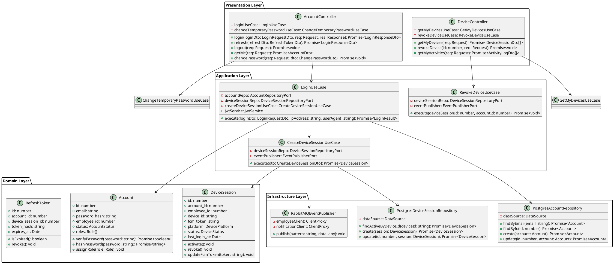

# Core Class Diagram

Class diagram thực tế cho 3 luồng nghiệp vụ chính từ code base.

---

## 1. Authentication Flow - Auth Service



---

## 2. Face Recognition & Attendance Flow

```plantuml
@startuml Attendance

package "Face Recognition Service (.NET)" {
  class FaceRecognitionController {
    -verifyFaceUseCase: VerifyFaceUseCase
    --
    +VerifyFace(request: VerifyFaceRequest): Task<VerifyFaceResponse>
    +RegisterFace(request: RegisterFaceRequest): Task<RegisterFaceResponse>
  }
  
  class VerifyFaceUseCase {
    -faceEmbeddingRepository: IFaceEmbeddingRepository
    -faceDetector: IFaceDetector
    -embeddingExtractor: IEmbeddingExtractor
    --
    +ExecuteAsync(employeeId: int, imageBase64: string): Task<VerificationResult>
    -DetectFace(image: Mat): FaceDetectionResult
    -ExtractEmbedding(faceImage: Mat): float[]
    -CalculateSimilarity(embedding1: float[], embedding2: float[]): double
  }
  
  class FaceEmbeddingRepository {
    -dbContext: ApplicationDbContext
    --
    +GetByEmployeeIdAsync(employeeId: int): Task<List<FaceEmbedding>>
    +CreateAsync(embedding: FaceEmbedding): Task<FaceEmbedding>
    +UpdateAsync(embedding: FaceEmbedding): Task<void>
  }
  
  class MTCNNFaceDetector {
    -mtcnn: MTCNN
    --
    +DetectFaces(image: Mat): List<Rectangle>
    +ExtractFace(image: Mat, rectangle: Rectangle): Mat
  }
  
  class FaceNetEmbeddingExtractor {
    -model: TensorFlowModel
    --
    +Extract(faceImage: Mat): float[]
  }
}

package "Attendance Service (NestJS)" {
  class AttendanceController {
    -recordAttendanceUseCase: RecordAttendanceUseCase
    -getAttendanceHistoryUseCase: GetAttendanceHistoryUseCase
    --
    +checkIn(dto: CheckInDto, user: JwtPayload): Promise<AttendanceDto>
    +checkOut(dto: CheckOutDto, user: JwtPayload): Promise<AttendanceDto>
    +getMyAttendance(date: Date, user: JwtPayload): Promise<AttendanceDto[]>
  }
  
  class RecordAttendanceUseCase {
    -attendanceRepo: AttendanceRepositoryPort
    -beaconService: BeaconService
    -locationService: LocationService
    -eventPublisher: EventPublisherPort
    --
    +execute(dto: RecordAttendanceDto): Promise<AttendanceRecord>
    -validateBeacons(beaconIds: string[]): Promise<boolean>
    -validateLocation(latitude: number, longitude: number): Promise<boolean>
    -calculateStatus(checkInTime: Date, shift: Shift): AttendanceStatus
  }
  
  class BeaconService {
    -beaconRepo: BeaconRepositoryPort
    --
    +validateBeacons(beaconIds: string[]): Promise<boolean>
    +getLocationByBeacon(beaconId: string): Promise<Location>
  }
  
  class LocationService {
    -locationRepo: LocationRepositoryPort
    --
    +calculateDistance(lat1: number, lng1: number, lat2: number, lng2: number): number
    +isWithinOffice(latitude: number, longitude: number): Promise<boolean>
  }
}

package "Domain Layer" {
  class AttendanceRecord {
    +id: number
    +employee_id: number
    +check_in_time: Date
    +check_out_time: Date
    +status: AttendanceStatus
    +verification_method: VerificationMethod
    +similarity_score: number
    +location: GeoLocation
    +beacon_ids: string[]
    --
    +calculateWorkingHours(): number
    +isLate(shift: Shift): boolean
    +checkOut(time: Date): void
  }
  
  class Beacon {
    +id: number
    +beacon_id: string
    +uuid: string
    +major: number
    +minor: number
    +location_id: number
    --
    +isActive(): boolean
  }
  
  class FaceEmbedding {
    +id: int
    +employee_id: int
    +embedding_vector: float[]
    +image_url: string
    +quality_score: double
    --
    +CalculateSimilarity(other: float[]): double
  }
}

' Relationships
FaceRecognitionController --> VerifyFaceUseCase
VerifyFaceUseCase --> FaceEmbeddingRepository
VerifyFaceUseCase --> MTCNNFaceDetector
VerifyFaceUseCase --> FaceNetEmbeddingExtractor

AttendanceController --> RecordAttendanceUseCase
RecordAttendanceUseCase --> AttendanceRecord
RecordAttendanceUseCase --> BeaconService
RecordAttendanceUseCase --> LocationService

@enduml
```



---

## 3. Leave Management Flow

```plantuml
@startuml Leave

package "Presentation Layer" {
  class LeaveController {
    -createLeaveRequestUseCase: CreateLeaveRequestUseCase
    -getLeaveBalanceUseCase: GetLeaveBalanceUseCase
    -approveLeaveUseCase: ApproveLeaveUseCase
    -rejectLeaveUseCase: RejectLeaveUseCase
    --
    +createLeaveRequest(dto: CreateLeaveRequestDto, user: JwtPayload): Promise<LeaveRequestDto>
    +getMyLeaveBalance(user: JwtPayload): Promise<LeaveBalanceDto>
    +approveLeave(id: string, dto: ApproveLeaveDto, user: JwtPayload): Promise<LeaveRequestDto>
    +rejectLeave(id: string, dto: RejectLeaveDto, user: JwtPayload): Promise<LeaveRequestDto>
    +getMyLeaveRequests(user: JwtPayload): Promise<LeaveRequestDto[]>
  }
}

package "Application Layer" {
  class CreateLeaveRequestUseCase {
    -leaveRequestRepo: LeaveRequestRepositoryPort
    -leaveBalanceRepo: LeaveBalanceRepositoryPort
    -employeeServiceClient: ClientProxy
    -eventPublisher: EventPublisherPort
    --
    +execute(dto: CreateLeaveRequestDto): Promise<LeaveRequest>
    -validateBalance(employeeId: number, days: number, type: LeaveType): Promise<void>
    -checkOverlapping(employeeId: number, startDate: Date, endDate: Date): Promise<boolean>
    -calculateWorkingDays(startDate: Date, endDate: Date): number
  }
  
  class ApproveLeaveUseCase {
    -leaveRequestRepo: LeaveRequestRepositoryPort
    -leaveBalanceRepo: LeaveBalanceRepositoryPort
    -eventPublisher: EventPublisherPort
    --
    +execute(requestId: string, approverId: number, comment: string): Promise<LeaveRequest>
    -validateApprover(request: LeaveRequest, approverId: number): void
    -deductBalance(employeeId: number, days: number, type: LeaveType): Promise<void>
  }
  
  class GetLeaveBalanceUseCase {
    -leaveBalanceRepo: LeaveBalanceRepositoryPort
    --
    +execute(employeeId: number, year: number): Promise<LeaveBalance>
  }
}

package "Domain Layer" {
  class LeaveRequest {
    +id: string
    +employee_id: number
    +leave_type: LeaveType
    +start_date: Date
    +end_date: Date
    +working_days: number
    +reason: string
    +status: LeaveStatus
    +approver_id: number
    +approved_at: Date
    +approver_comment: string
    --
    +approve(approverId: number, comment: string): void
    +reject(approverId: number, reason: string): void
    +cancel(): void
    +isPending(): boolean
    +canBeApprovedBy(approverId: number): boolean
  }
  
  class LeaveBalance {
    +id: number
    +employee_id: number
    +year: number
    +annual_leave_total: number
    +annual_leave_used: number
    +sick_leave_total: number
    +sick_leave_used: number
    --
    +getRemainingAnnual(): number
    +getRemainingSick(): number
    +deduct(type: LeaveType, days: number): void
    +hasEnoughBalance(type: LeaveType, days: number): boolean
  }
  
  class WorkingDayCalculator {
    -publicHolidayRepo: PublicHolidayRepositoryPort
    --
    +calculate(startDate: Date, endDate: Date): number
    -isWeekend(date: Date): boolean
    -isPublicHoliday(date: Date): boolean
  }
}

package "Infrastructure Layer" {
  class PostgresLeaveRequestRepository {
    -dataSource: DataSource
    --
    +findById(id: string): Promise<LeaveRequest>
    +findByEmployeeId(employeeId: number): Promise<LeaveRequest[]>
    +checkOverlapping(employeeId: number, startDate: Date, endDate: Date): Promise<boolean>
    +create(request: LeaveRequest): Promise<LeaveRequest>
    +update(id: string, request: LeaveRequest): Promise<LeaveRequest>
  }
  
  class PostgresLeaveBalanceRepository {
    -dataSource: DataSource
    --
    +findByEmployeeAndYear(employeeId: number, year: number): Promise<LeaveBalance>
    +update(id: number, balance: LeaveBalance): Promise<LeaveBalance>
  }
  
  class RabbitMQEventPublisher {
    -notificationClient: ClientProxy
    --
    +publish(pattern: string, data: any): void
  }
}

' Relationships
LeaveController --> CreateLeaveRequestUseCase
LeaveController --> ApproveLeaveUseCase
LeaveController --> GetLeaveBalanceUseCase

CreateLeaveRequestUseCase --> LeaveRequest
CreateLeaveRequestUseCase --> LeaveBalance
CreateLeaveRequestUseCase --> WorkingDayCalculator
CreateLeaveRequestUseCase --> PostgresLeaveRequestRepository
CreateLeaveRequestUseCase --> PostgresLeaveBalanceRepository
CreateLeaveRequestUseCase --> RabbitMQEventPublisher

ApproveLeaveUseCase --> LeaveRequest
ApproveLeaveUseCase --> LeaveBalance
ApproveLeaveUseCase --> PostgresLeaveRequestRepository
ApproveLeaveUseCase --> RabbitMQEventPublisher

@enduml
```



---

## 4. Notification System

```plantuml
@startuml Notification

package "Presentation Layer" {
  class NotificationController {
    -sendNotificationUseCase: SendNotificationUseCase
    -getUserNotificationsUseCase: GetUserNotificationsUseCase
    -markAsReadUseCase: MarkAsReadUseCase
    --
    +sendNotification(dto: SendNotificationDto): Promise<NotificationDto>
    +getUserNotifications(user: JwtPayload, query: PaginationDto): Promise<NotificationDto[]>
    +markAsRead(id: number, user: JwtPayload): Promise<void>
    +getUnreadCount(user: JwtPayload): Promise<number>
  }
  
  class PushTokenController {
    -registerPushTokenUseCase: RegisterPushTokenUseCase
    -unregisterPushTokenUseCase: UnregisterPushTokenUseCase
    --
    +registerToken(dto: RegisterPushTokenDto, user: JwtPayload): Promise<PushTokenDto>
    +unregisterToken(dto: UnregisterPushTokenDto, user: JwtPayload): Promise<void>
  }
  
  class DeviceSessionCreatedListener {
    -registerPushTokenUseCase: RegisterPushTokenUseCase
    --
    +handleDeviceSessionCreated(data: DeviceSessionCreatedPayload): Promise<void>
  }
  
  class AttendanceEventListener {
    -sendNotificationUseCase: SendNotificationUseCase
    --
    +handleCheckedIn(data: AttendanceCheckedInPayload): Promise<void>
  }
  
  class LeaveEventListener {
    -sendNotificationUseCase: SendNotificationUseCase
    --
    +handleLeaveCreated(data: LeaveRequestCreatedPayload): Promise<void>
    +handleLeaveApproved(data: LeaveRequestApprovedPayload): Promise<void>
    +handleLeaveRejected(data: LeaveRequestRejectedPayload): Promise<void>
  }
}

package "Application Layer" {
  class SendNotificationUseCase {
    -notificationRepo: NotificationRepositoryPort
    -preferenceRepo: NotificationPreferenceRepositoryPort
    -pushTokenRepo: PushTokenRepositoryPort
    -pushService: IPushNotificationService
    -emailService: IEmailService
    --
    +execute(dto: SendNotificationDto): Promise<Notification>
    -getEnabledChannels(recipientId: number, channels: Channel[]): Promise<Channel[]>
    -sendViaPush(notification: Notification): Promise<void>
    -sendViaEmail(notification: Notification): Promise<void>
  }
  
  class RegisterPushTokenUseCase {
    -pushTokenRepo: PushTokenRepositoryPort
    -authServiceClient: ClientProxy
    --
    +execute(employeeId: number, dto: RegisterPushTokenDto): Promise<PushToken>
    -syncDeviceSessionId(employeeId: number, deviceId: string): Promise<number>
  }
  
  class GetUserNotificationsUseCase {
    -notificationRepo: NotificationRepositoryPort
    --
    +execute(userId: number, pagination: PaginationDto): Promise<Notification[]>
  }
}

package "Domain Layer" {
  class Notification {
    +id: number
    +recipient_id: number
    +title: string
    +body: string
    +notification_type: NotificationType
    +channels: DeliveryChannel[]
    +data: object
    +is_read: boolean
    +read_at: Date
    --
    +markAsRead(): void
    +isRead(): boolean
    +getEnabledChannels(): Channel[]
  }
  
  class PushToken {
    +id: number
    +employee_id: number
    +device_id: string
    +device_session_id: number
    +token: string
    +platform: Platform
    +is_active: boolean
    +last_used_at: Date
    --
    +activate(): void
    +deactivate(): void
    +updateLastUsed(): void
  }
  
  class NotificationPreference {
    +id: number
    +employee_id: number
    +notification_type: NotificationType
    +push_enabled: boolean
    +email_enabled: boolean
    +in_app_enabled: boolean
    +dnd_start_time: string
    +dnd_end_time: string
    --
    +isChannelEnabled(channel: Channel): boolean
    +isDNDActive(): boolean
  }
  
  class DeliveryChannel {
    +type: Channel
    +enabled: boolean
    --
    {static} +fromChannels(channels: Channel[]): DeliveryChannel[]
    {static} +toChannels(deliveryChannels: DeliveryChannel[]): Channel[]
  }
}

package "Infrastructure Layer" {
  class FirebasePushNotificationService {
    -admin: FirebaseAdmin
    --
    +sendToDevice(token: string, payload: PushPayload): Promise<void>
    +sendMulticast(tokens: string[], payload: PushPayload): Promise<BatchResponse>
  }
  
  class NodemailerEmailService {
    -transporter: Transporter
    --
    +send(to: string, subject: string, html: string): Promise<void>
  }
  
  class PostgresPushTokenRepository {
    -dataSource: DataSource
    --
    +findByDeviceId(employeeId: number, deviceId: string): Promise<PushToken>
    +findActiveByEmployee(employeeId: number): Promise<PushToken[]>
    +create(token: PushToken): Promise<PushToken>
    +update(token: PushToken): Promise<PushToken>
  }
  
  class PostgresNotificationRepository {
    -dataSource: DataSource
    --
    +findByRecipient(recipientId: number, options: PaginationDto): Promise<Notification[]>
    +create(notification: Notification): Promise<Notification>
    +update(id: number, notification: Notification): Promise<Notification>
    +getUnreadCount(recipientId: number): Promise<number>
  }
}

' Relationships
NotificationController --> SendNotificationUseCase
NotificationController --> GetUserNotificationsUseCase
PushTokenController --> RegisterPushTokenUseCase

DeviceSessionCreatedListener --> RegisterPushTokenUseCase
AttendanceEventListener --> SendNotificationUseCase
LeaveEventListener --> SendNotificationUseCase

SendNotificationUseCase --> Notification
SendNotificationUseCase --> NotificationPreference
SendNotificationUseCase --> PushToken
SendNotificationUseCase --> FirebasePushNotificationService
SendNotificationUseCase --> NodemailerEmailService
SendNotificationUseCase --> PostgresNotificationRepository
SendNotificationUseCase --> PostgresPushTokenRepository

RegisterPushTokenUseCase --> PushToken
RegisterPushTokenUseCase --> PostgresPushTokenRepository

@enduml
```



---

## 5. Complete Domain Model (Entity Relationships)

```plantuml
@startuml CompleteDomain

' Employee Domain
package "Employee Domain" {
  class Employee {
    +id: number
    +employee_code: string
    +email: string
    +full_name: string
    +phone: string
    +date_of_birth: Date
    +gender: Gender
    +hire_date: Date
    +position: string
    +department_id: number
    +manager_id: number
    +status: EmployeeStatus
    --
    +isActive(): boolean
    +calculateAge(): number
    +getYearsOfService(): number
  }
  
  class Department {
    +id: number
    +name: string
    +code: string
    +parent_id: number
    +manager_id: number
    --
    +getFullHierarchy(): Department[]
    +isLeafDepartment(): boolean
  }
}

' Auth Domain
package "Auth Domain" {
  class Account {
    +id: number
    +username: string
    +password_hash: string
    +employee_id: number
    +is_active: boolean
    +last_login_at: Date
    --
    +validatePassword(password: string): boolean
    +updateLastLogin(): void
  }

  class DeviceSession {
    +id: number
    +employee_id: number
    +device_id: string
    +fcm_token: string
    +device_type: DeviceType
    +device_name: string
    +ip_address: string
    +last_active_at: Date
    --
    +isActive(): boolean
    +refreshSession(): void
    +updateFcmToken(token: string): void
  }

  class RefreshToken {
    +id: number
    +token: string
    +employee_id: number
    +expires_at: Date
    +revoked: boolean
    --
    +isExpired(): boolean
    +isValid(): boolean
    +revoke(): void
  }
}

' Attendance Domain
package "Attendance Domain" {
  class AttendanceRecord {
    +id: number
    +employee_id: number
    +date: Date
    +check_in_time: Date
    +check_out_time: Date
    +status: AttendanceStatus
    +work_duration: number
    +late_duration: number
    +location: string
    --
    +calculateWorkDuration(): number
    +calculateLateDuration(): number
    +isComplete(): boolean
    +checkOut(time: Date): void
  }

  class FaceEmbedding {
    +id: number
    +employee_id: number
    +embedding: number[]
    +image_url: string
    +registered_at: Date
    +is_active: boolean
    --
    +calculateSimilarity(other: FaceEmbedding): number
    +activate(): void
    +deactivate(): void
  }

  class BeaconDevice {
    +id: number
    +uuid: string
    +major: number
    +minor: number
    +location_name: string
    +is_active: boolean
    --
    +matches(uuid: string, major: number, minor: number): boolean
  }
}

' Leave Domain
package "Leave Domain" {
  class LeaveRequest {
    +id: string
    +employee_id: number
    +leave_type: LeaveType
    +start_date: Date
    +end_date: Date
    +working_days: number
    +reason: string
    +status: LeaveStatus
    +approver_id: number
    +approved_at: Date
    +approver_comment: string
    --
    +approve(approverId: number, comment: string): void
    +reject(approverId: number, reason: string): void
    +cancel(): void
    +isPending(): boolean
    +canBeApprovedBy(approverId: number): boolean
  }

  class LeaveBalance {
    +id: number
    +employee_id: number
    +year: number
    +annual_leave_total: number
    +annual_leave_used: number
    +sick_leave_total: number
    +sick_leave_used: number
    --
    +getRemainingAnnual(): number
    +getRemainingSick(): number
    +deduct(type: LeaveType, days: number): void
    +hasEnoughBalance(type: LeaveType, days: number): boolean
  }
}

' Notification Domain
package "Notification Domain" {
  class Notification {
    +id: number
    +recipient_id: number
    +title: string
    +body: string
    +notification_type: NotificationType
    +channels: DeliveryChannel[]
    +data: object
    +is_read: boolean
    +read_at: Date
    --
    +markAsRead(): void
    +isRead(): boolean
  }

  class PushToken {
    +id: number
    +employee_id: number
    +device_id: string
    +device_session_id: number
    +token: string
    +platform: Platform
    +is_active: boolean
    +last_used_at: Date
    --
    +activate(): void
    +deactivate(): void
    +updateLastUsed(): void
  }

  class NotificationPreference {
    +id: number
    +employee_id: number
    +notification_type: NotificationType
    +push_enabled: boolean
    +email_enabled: boolean
    +in_app_enabled: boolean
    --
    +isChannelEnabled(channel: Channel): boolean
  }
}

' Cross-Domain Relationships
Employee "1" -- "0..1" Account : has
Employee "1" -- "0..*" DeviceSession : uses
Employee "1" -- "0..*" RefreshToken : owns
Employee "1" -- "0..*" AttendanceRecord : creates
Employee "1" -- "1..*" FaceEmbedding : registered
Employee "1" -- "0..*" LeaveRequest : submits
Employee "1" -- "0..*" LeaveRequest : approves
Employee "1" -- "1..*" LeaveBalance : has
Employee "1" -- "0..*" Notification : receives
Employee "1" -- "0..*" PushToken : owns
Employee "0..*" -- "1" Department : belongs_to
Department "0..*" -- "0..1" Department : parent_of

DeviceSession "1" -- "0..1" PushToken : syncs
Account "1" -- "0..*" DeviceSession : has

note right of DeviceSession
  When created with FCM token:
  → Publishes device_session_created
  → Notification Service syncs PushToken
end note

note right of AttendanceRecord
  When checked-in:
  → Publishes attendance.checked-in
  → Notification Service sends push
end note

note right of LeaveRequest
  On status change:
  → Publishes leave.request.*
  → Notifies employee & manager
end note

@enduml
```



---

## 6. Microservices Architecture & Communication

```plantuml
@startuml ServiceArchitecture

package "Auth Service (NestJS)" {
  component AccountController
  component DeviceController
  component LoginUseCase
  component CreateDeviceSessionUseCase
  component PostgresAccountRepository
  component PostgresDeviceSessionRepository
  
  AccountController --> LoginUseCase
  LoginUseCase --> CreateDeviceSessionUseCase
  CreateDeviceSessionUseCase --> PostgresDeviceSessionRepository
}

package "Employee Service (NestJS)" {
  component EmployeeController
  component GetEmployeeUseCase
  component CreateDepartmentUseCase
  component PostgresEmployeeRepository
  component PostgresDepartmentRepository
  
  EmployeeController --> GetEmployeeUseCase
  GetEmployeeUseCase --> PostgresEmployeeRepository
}

package "Attendance Service (NestJS)" {
  component AttendanceController
  component RecordAttendanceUseCase
  component BeaconService
  component LocationService
  component PostgresAttendanceRepository
  
  AttendanceController --> RecordAttendanceUseCase
  RecordAttendanceUseCase --> BeaconService
  RecordAttendanceUseCase --> LocationService
  RecordAttendanceUseCase --> PostgresAttendanceRepository
}

package "Face Recognition Service (.NET Core 8)" {
  component FaceRecognitionController
  component VerifyFaceUseCase
  component MTCNNFaceDetector
  component FaceNetEmbeddingExtractor
  component PostgresFaceEmbeddingRepository
  
  FaceRecognitionController --> VerifyFaceUseCase
  VerifyFaceUseCase --> MTCNNFaceDetector
  VerifyFaceUseCase --> FaceNetEmbeddingExtractor
  VerifyFaceUseCase --> PostgresFaceEmbeddingRepository
}

package "Leave Service (NestJS)" {
  component LeaveController
  component CreateLeaveRequestUseCase
  component ApproveLeaveUseCase
  component PostgresLeaveRequestRepository
  component PostgresLeaveBalanceRepository
  
  LeaveController --> CreateLeaveRequestUseCase
  LeaveController --> ApproveLeaveUseCase
  CreateLeaveRequestUseCase --> PostgresLeaveRequestRepository
  ApproveLeaveUseCase --> PostgresLeaveBalanceRepository
}

package "Notification Service (NestJS)" {
  component NotificationController
  component PushTokenController
  component SendNotificationUseCase
  component RegisterPushTokenUseCase
  component "DeviceSessionCreatedListener" as DSListener
  component "AttendanceEventListener" as AEListener
  component "LeaveEventListener" as LEListener
  component FirebasePushService
  component PostgresPushTokenRepository
  component PostgresNotificationRepository
  
  NotificationController --> SendNotificationUseCase
  PushTokenController --> RegisterPushTokenUseCase
  
  DSListener --> RegisterPushTokenUseCase
  AEListener --> SendNotificationUseCase
  LEListener --> SendNotificationUseCase
  
  SendNotificationUseCase --> FirebasePushService
  SendNotificationUseCase --> PostgresPushTokenRepository
  SendNotificationUseCase --> PostgresNotificationRepository
  RegisterPushTokenUseCase --> PostgresPushTokenRepository
}

queue "RabbitMQ Event Bus" as RabbitMQ {
  [device_session_created]
  [attendance.checked-in]
  [leave.request.created]
  [leave.request.approved]
  [leave.request.rejected]
}

database "PostgreSQL Databases" as DB {
  [auth_db]
  [employee_db]
  [attendance_db]
  [face_recognition_db]
  [leave_db]
  [notification_db]
}

cloud "Firebase Cloud Messaging" as FCM

' Event Flow
CreateDeviceSessionUseCase --> RabbitMQ : publish\ndevice_session_created
RabbitMQ --> DSListener : consume

RecordAttendanceUseCase --> RabbitMQ : publish\nattendance.checked-in
RabbitMQ --> AEListener : consume

CreateLeaveRequestUseCase --> RabbitMQ : publish\nleave.request.created
ApproveLeaveUseCase --> RabbitMQ : publish\nleave.request.approved
RabbitMQ --> LEListener : consume

' Database Connections
PostgresAccountRepository --> DB
PostgresDeviceSessionRepository --> DB
PostgresEmployeeRepository --> DB
PostgresAttendanceRepository --> DB
PostgresFaceEmbeddingRepository --> DB
PostgresLeaveRequestRepository --> DB
PostgresPushTokenRepository --> DB
PostgresNotificationRepository --> DB

' External Service
FirebasePushService --> FCM : Send Push\nNotifications

note right of RabbitMQ
  Event-Driven Architecture:
  - Async communication
  - Loose coupling
  - Self-healing (UPSERT logic)
end note

note bottom of DB
  Each service owns its database
  (Database-per-Service Pattern)
end note

@enduml
```



---

## Usage Instructions

### PlantUML
Copy các đoạn code trong ``` plantuml ``` vào [PlantUML Online Editor](http://www.plantuml.com/plantuml/uml/) để generate diagram.

### Mermaid (Alternative)
Hoặc có thể convert sang Mermaid syntax để dùng trong Markdown viewers.

### Tool Recommendations
- **Draw.io / Lucidchart**: Import PlantUML hoặc vẽ manual
- **StarUML / Visual Paradigm**: Professional UML tools
- **VS Code Extension**: PlantUML extension để preview trực tiếp

---

## Key Design Patterns

### 1. **Repository Pattern**
- Tách biệt business logic khỏi data access
- Mỗi entity có repository riêng

### 2. **Use Case Pattern**
- Mỗi business operation là 1 use case
- Single Responsibility Principle

### 3. **Event-Driven Architecture**
- Services giao tiếp qua RabbitMQ events
- Loose coupling, high cohesion

### 4. **Domain-Driven Design**
- Entity có behavior (methods)
- Aggregate roots (Employee, Account, LeaveRequest)

---

## Entity Relationships Summary

```
Employee (1) ←→ (0..1) Account
Account (1) ←→ (*) DeviceSession
DeviceSession (1) ←→ (0..1) PushToken
Employee (1) ←→ (*) PushToken

Employee (1) ←→ (*) FaceEmbedding
Employee (1) ←→ (*) AttendanceRecord
Employee (1) ←→ (1) Shift

Employee (1) ←→ (*) LeaveRequest [as requestor]
Employee (1) ←→ (*) LeaveRequest [as approver]
Employee (1) ←→ (1) LeaveBalance

Employee (1) ←→ (*) Notification
Employee (1) ←→ (1) NotificationPreference
```

---

## Summary

Class diagram này mô tả chi tiết kiến trúc thực tế của hệ thống với 6 sections:

### 1. Authentication Flow (Auth Service)
- **Controllers**: AccountController, DeviceController
- **Use Cases**: LoginUseCase, CreateDeviceSessionUseCase
- **Domain**: Account, DeviceSession, RefreshToken
- **Infrastructure**: PostgresAccountRepository, PostgresDeviceSessionRepository, RabbitMQEventPublisher
- **Event**: device_session_created (published to sync FCM token)

### 2. Face Recognition Attendance Flow (2 Services)
**Face Recognition Service (.NET Core 8)**:
- **Controllers**: FaceRecognitionController
- **Use Cases**: VerifyFaceUseCase
- **Domain**: FaceEmbedding (128-dim vector)
- **AI Models**: MTCNNFaceDetector, FaceNetEmbeddingExtractor

**Attendance Service (NestJS)**:
- **Controllers**: AttendanceController
- **Use Cases**: RecordAttendanceUseCase
- **Domain**: AttendanceRecord, BeaconDevice
- **Services**: BeaconService (validate office location), LocationService
- **Event**: attendance.checked-in (published for notification)

### 3. Leave Management Flow (Leave Service)
- **Controllers**: LeaveController
- **Use Cases**: CreateLeaveRequestUseCase, ApproveLeaveUseCase, GetLeaveBalanceUseCase
- **Domain**: LeaveRequest, LeaveBalance, WorkingDayCalculator
- **Infrastructure**: PostgresLeaveRequestRepository, PostgresLeaveBalanceRepository
- **Events**: leave.request.created, leave.request.approved, leave.request.rejected

### 4. Notification System (Notification Service)
- **Controllers**: NotificationController, PushTokenController
- **Use Cases**: SendNotificationUseCase, RegisterPushTokenUseCase
- **Event Listeners**: DeviceSessionCreatedListener, AttendanceEventListener, LeaveEventListener
- **Domain**: Notification, PushToken, NotificationPreference, DeliveryChannel
- **Infrastructure**: FirebasePushNotificationService, NodemailerEmailService
- **Database**: PostgresPushTokenRepository, PostgresNotificationRepository

### 5. Complete Domain Model
Mô tả toàn bộ entities và relationships giữa các domain:
- **Employee Domain**: Employee, Department
- **Auth Domain**: Account, DeviceSession, RefreshToken
- **Attendance Domain**: AttendanceRecord, FaceEmbedding, BeaconDevice
- **Leave Domain**: LeaveRequest, LeaveBalance
- **Notification Domain**: Notification, PushToken, NotificationPreference

### 6. Microservices Architecture
Kiến trúc tổng quan các services giao tiếp qua RabbitMQ:
- **6 Services**: Auth, Employee, Attendance, Face Recognition, Leave, Notification
- **Event Bus**: RabbitMQ với 5 event patterns
- **Database per Service**: Mỗi service có database riêng (PostgreSQL)
- **External Services**: Firebase Cloud Messaging cho push notifications

---

## Key Design Patterns

### 1. **Clean Architecture (4 Layers)**
```
Presentation (Controllers)
    ↓
Application (Use Cases)
    ↓
Domain (Entities + Business Logic)
    ↓
Infrastructure (Repositories, External Services)
```

### 2. **Event-Driven Architecture**
- Services giao tiếp async qua RabbitMQ events
- Loose coupling, high scalability
- Self-healing (UPSERT logic prevents duplicates)

### 3. **Repository Pattern**
- Tách biệt business logic khỏi data access
- Interface Port (Domain) + Adapter (Infrastructure)

### 4. **Use Case Pattern**
- Mỗi business operation = 1 Use Case class
- Single Responsibility Principle
- Reusable, testable

### 5. **Domain-Driven Design**
- Entities có behaviors (methods)
- Aggregate roots (Employee, Account, LeaveRequest)
- Value objects (DeliveryChannel, AttendanceStatus)

---

## Technology Stack

- **Backend**: NestJS 11.x (TypeScript), .NET Core 8.0 (C#)
- **Database**: PostgreSQL with TypeORM / Entity Framework Core
- **Message Queue**: RabbitMQ (event-driven communication)
- **Push Notifications**: Firebase Cloud Messaging
- **AI/ML**: MTCNN (face detection), FaceNet (128-dim embeddings)
- **Bluetooth**: Beacon validation for office location

---

## Conclusion

Diagram này phản ánh đúng code implementation thực tế với:
- ✅ Actual class names từ source code
- ✅ Real methods and attributes
- ✅ 4-layer Clean Architecture
- ✅ Event-driven communication patterns
- ✅ Cross-service relationships via RabbitMQ
- ✅ Database-per-Service pattern
- ✅ UPSERT logic for self-healing
