# System Architecture Diagram

High-level system architecture showing how users interact with the system.

---

## 1. System Architecture Overview

```plantuml
@startuml SystemArchitecture

skinparam backgroundColor #FFFFFF
skinparam shadowing false
skinparam defaultFontSize 11

' ================== ACTORS ==================
rectangle "�\n\n<b>Employee</b>\n<size:9>(End User)</size>" as Employee #FFB300
rectangle "👔\n\n<b>Manager</b>\n<size:9>(Approver)</size>" as Manager #66BB6A
rectangle "⚙️\n\n<b>HR Admin</b>\n<size:9>(Administrator)</size>" as Admin #42A5F5

' ================== CLIENT APPLICATIONS ==================
rectangle "📱\n\n<b>Mobile App</b>\n<size:9>(Flutter - iOS/Android)</size>" as MobileApp #FDD835
rectangle "🌐\n\n<b>Web Dashboard</b>\n<size:9>(Next.js - React)</size>" as WebApp #FDD835

' ================== BEACONS ==================
rectangle "📡\n\n<b>Bluetooth Beacons</b>\n<size:9>(Office Location Validator)</size>" as Beacon #29B6F6

' ================== BACKEND ==================
rectangle "🖥️\n\n<b>Backend Server</b>\n<size:9>(Microservices Architecture)</size>" as Backend #5C6BC0

' ================== DATABASES ==================
database "🗄️\n\n<b>PostgreSQL</b>\n<size:9>(Primary Database)</size>" as Database #4CAF50
database "⚡\n\n<b>Redis</b>\n<size:9>(Cache Layer)</size>" as RedisCache #EF5350

' ================== EXTERNAL SERVICES ==================
cloud "🔔\n\n<b>Firebase</b>\n<size:9>(Push Notifications)</size>" as FCM #FF7043
cloud "📧\n\n<b>Email Service</b>\n<size:9>(SMTP Server)</size>" as Email #26A69A

' ================== CONNECTIONS ==================

' Users to Apps
Employee -down-> MobileApp : <size:8>Login, Check-in\nSubmit leave</size>
Manager -down-> WebApp : <size:8>Approve leaves\nView reports</size>
Admin -down-> WebApp : <size:8>Manage employees\nSystem config</size>

' Mobile App to Beacon
MobileApp .right.> Beacon : <size:8>Scan beacon\n(Bluetooth)</size>

' Apps to Backend
MobileApp -down-> Backend : <size:8>HTTPS/REST API</size>
WebApp -down-> Backend : <size:8>HTTPS/REST API</size>

' Backend to Databases
Backend -down-> Database : <size:8>Read/Write data</size>
Backend -down-> RedisCache : <size:8>Cache & Sessions</size>

' Backend to External
Backend -right-> FCM : <size:8>Push notifications</size>
Backend -right-> Email : <size:8>Email notifications</size>

note top of MobileApp
  <b>Client Layer</b>
end note

note right of Backend
  <b>Application Layer</b>
end note

note bottom of Database
  <b>Data Layer</b>
end note

note right of FCM
  <b>External Services</b>
end note

@enduml
```



---

## 2. User Journey Flow


---

## 3. Data Flow (Authentication & Attendance)

```plantuml
@startuml DataFlow

skinparam backgroundColor white

actor "Employee" as User #FFA500

participant "Mobile App" as App #FFD700
participant "Bluetooth\nBeacon" as Beacon #87CEEB
participant "Backend\nServer" as Server #4169E1
database "Database" as DB #2E8B57
cloud "Firebase\nCM" as FCM #FF6347

== Authentication Flow ==
User -> App: 1. Enter credentials
App -> Server: 2. POST /auth/login
Server -> DB: 3. Validate user
DB --> Server: 4. User data
Server -> DB: 5. Create device session
Server --> App: 6. JWT token + Refresh token
Server -> FCM: 7. Register FCM token\n(for push notifications)

== Face Recognition Check-in Flow ==
User -> App: 8. Tap "Check-in"
App -> Beacon: 9. Scan Bluetooth beacon
Beacon --> App: 10. Beacon ID (UUID, Major, Minor)
User -> App: 11. Capture face photo
App -> Server: 12. POST /attendance/check-in\n(face image + beacon data)
Server -> Server: 13. Validate beacon location
Server -> Server: 14. Verify face using AI/ML\n(MTCNN + FaceNet)
Server -> DB: 15. Save attendance record
DB --> Server: 16. Save successful
Server --> App: 17. Check-in confirmed
Server -> FCM: 18. Send push notification
FCM --> App: 19. "Check-in successful!"

note right of Server
  Face Recognition:
  - MTCNN detects face
  - FaceNet creates 128-dim embedding
  - Compare with stored embedding
  - Threshold: 0.6 similarity
end note

note right of Beacon
  Bluetooth Beacon validates
  employee is physically
  in the office location
end note

@enduml
```

---

## 4. Leave Request & Approval Flow

```plantuml
@startuml LeaveFlow

skinparam backgroundColor white

actor "Employee" as Employee #FFA500
actor "Manager" as Manager #90EE90
participant "Mobile App" as MobileApp #FFD700
participant "Web App" as WebApp #FFD700
participant "Backend\nServer" as Server #4169E1
database "Database" as DB #2E8B57
cloud "Firebase\nCM" as FCM #FF6347

== Leave Request Submission ==
Employee -> MobileApp: 1. Open leave request form
Employee -> MobileApp: 2. Select dates & type\n(Annual/Sick leave)
MobileApp -> Server: 3. POST /leave/requests
Server -> DB: 4. Check leave balance
DB --> Server: 5. Balance available
Server -> DB: 6. Create leave request\n(Status: PENDING)
DB --> Server: 7. Request saved
Server --> MobileApp: 8. Request submitted successfully
Server -> FCM: 9. Notify manager
FCM -> Manager: 10. Push notification:\n"New leave request from [Employee]"

== Leave Approval ==
Manager -> WebApp: 11. Login to dashboard
Manager -> WebApp: 12. View pending leave requests
Manager -> WebApp: 13. Review request details
Manager -> WebApp: 14. Click "Approve" or "Reject"
WebApp -> Server: 15. PUT /leave/requests/:id/approve
Server -> DB: 16. Update status to APPROVED
Server -> DB: 17. Deduct from leave balance
DB --> Server: 18. Update successful
Server --> WebApp: 19. Approval recorded
Server -> FCM: 20. Notify employee
FCM -> Employee: 21. Push notification:\n"Your leave has been approved!"

note right of Server
  Business Rules:
  - Validate sufficient balance
  - Check overlapping requests
  - Calculate working days
  - Manager authorization
end note

@enduml
```

---

## 5. System Deployment View


---

## System Architecture Overview

### 1. **User Actors**
- **Employee**: End users who use mobile app for daily attendance and leave management
- **Manager**: Approves leave requests, views team reports
- **HR Admin**: Manages employees, system configuration, company-wide reports

### 2. **Client Applications**
- **Flutter Mobile App** (iOS/Android):
  - Face recognition check-in
  - Leave request submission
  - Push notifications
  - Bluetooth beacon detection
  
- **Next.js Web App** (React):
  - Admin portal
  - Manager dashboard
  - Analytics & reporting
  - Employee management

### 3. **API Gateway**
- **NGINX Ingress Controller**:
  - Routes traffic to microservices
  - SSL/TLS termination
  - Load balancing
  - Rate limiting

### 4. **Backend Services (Microservices)**
- **Auth Service**: Authentication, JWT, device session management
- **Employee Service**: Employee CRUD, department management
- **Attendance Service**: Check-in/out, attendance records, beacon validation
- **Face Recognition Service**: AI/ML face verification (MTCNN + FaceNet)
- **Leave Service**: Leave requests, approval workflow, balance management
- **Notification Service**: Push notifications (FCM), email, in-app notifications
- **Reporting Service**: Analytics, reports generation

### 5. **Message Queue**
- **RabbitMQ**: Event-driven communication between services
  - `device_session_created`
  - `attendance.checked-in`
  - `leave.request.created`
  - `leave.request.approved`
  - `leave.request.rejected`

### 6. **Data Storage**
- **PostgreSQL**: Primary database (Database-per-Service pattern)
  - auth_db
  - employee_db
  - attendance_db
  - face_recognition_db
  - leave_db
  - notification_db
  
- **Redis**: Cache layer for sessions and frequently accessed data

### 7. **External Services**
- **Firebase Cloud Messaging**: Push notifications to mobile devices
- **SMTP Server**: Email notifications
- **Bluetooth Beacons**: Office location validation

### 8. **Infrastructure**
- **Kubernetes**: Container orchestration, auto-scaling, self-healing
- **Docker**: Containerization of all services
- **Skaffold**: Local development with hot reload
- **GitHub Actions**: CI/CD pipeline
- **Prometheus + Grafana**: Monitoring and alerting

---

## Key Architectural Patterns

### 1. **Microservices Architecture**
- Each service is independently deployable
- Service-specific databases (Database-per-Service)
- Technology diversity (NestJS + .NET Core)

### 2. **Event-Driven Architecture**
- Asynchronous communication via RabbitMQ
- Loose coupling between services
- Self-healing with UPSERT logic

### 3. **API Gateway Pattern**
- Single entry point for all clients
- Cross-cutting concerns (auth, rate limiting)
- Service discovery and routing

### 4. **CQRS (Command Query Responsibility Segregation)**
- Reporting service reads from replica
- Write operations on master database
- Optimized for read-heavy workloads

### 5. **Cache-Aside Pattern**
- Redis cache for sessions and hot data
- Reduces database load
- Improves response time

---

## Technology Stack Summary

| Layer | Technology | Purpose |
|-------|-----------|---------|
| **Mobile Client** | Flutter (Dart) | Cross-platform mobile app (iOS/Android) |
| **Web Client** | Next.js (React, TypeScript) | Server-side rendered web application |
| **API Gateway** | NGINX Ingress | Routing, load balancing, SSL termination |
| **Backend Services** | NestJS (Node.js, TypeScript) | Auth, Employee, Attendance, Leave, Notification, Reporting |
| **AI/ML Service** | .NET Core 8 (C#) | Face Recognition with MTCNN + FaceNet |
| **Message Queue** | RabbitMQ | Event-driven async communication |
| **Database** | PostgreSQL 14+ | Primary data storage |
| **Cache** | Redis 7+ | Session store and cache layer |
| **Push Notifications** | Firebase Cloud Messaging | Mobile push notifications |
| **Email** | Nodemailer (SMTP) | Email notifications |
| **Bluetooth** | Beacon Protocol | Office location validation |
| **Container Runtime** | Docker | Application containerization |
| **Orchestration** | Kubernetes (K8s) | Container orchestration, scaling |
| **Local Dev** | Skaffold | Hot reload development |
| **CI/CD** | GitHub Actions | Automated build, test, deploy |
| **Monitoring** | Prometheus + Grafana | Metrics collection and visualization |

---

## Security Considerations

### 1. **Authentication & Authorization**
- JWT-based authentication
- Refresh token rotation
- Role-based access control (RBAC)

### 2. **Data Protection**
- HTTPS/TLS for all communications
- Encrypted passwords (bcrypt)
- Sensitive data encryption at rest

### 3. **API Security**
- Rate limiting at API gateway
- Input validation and sanitization
- CORS policy enforcement

### 4. **Infrastructure Security**
- Network policies in Kubernetes
- Secret management (Kubernetes Secrets)
- Pod security policies

### 5. **Privacy Compliance**
- Face embedding storage (not raw images)
- Data retention policies
- GDPR compliance ready

---

## Scalability & Performance

### 1. **Horizontal Scaling**
- Kubernetes auto-scaling based on CPU/memory
- Stateless services for easy replication
- Load balancing across pod replicas

### 2. **Caching Strategy**
- Redis cache for sessions (reduce DB load)
- Attendance records cache (frequently accessed)
- Employee data cache with TTL

### 3. **Database Optimization**
- Read replicas for reporting
- Connection pooling
- Indexed queries

### 4. **Async Processing**
- Event-driven notifications (non-blocking)
- Background jobs for reports
- Queue-based processing

---

## High Availability & Disaster Recovery

### 1. **Service Redundancy**
- Multiple replicas per service
- Health checks and auto-restart
- Rolling updates with zero downtime

### 2. **Database HA**
- PostgreSQL master-replica setup
- Automatic failover
- Point-in-time recovery

### 3. **Message Queue Durability**
- Persistent queues in RabbitMQ
- Message acknowledgment
- Dead letter exchange for failed messages

### 4. **Backup Strategy**
- Daily automated database backups
- 30-day retention policy
- Backup to external storage

---

## Conclusion

This system architecture diagram provides a **high-level view** of the attendance management system, showing:
- ✅ User actors and their interactions
- ✅ Client applications (mobile & web)
- ✅ Backend microservices architecture
- ✅ Data storage strategy
- ✅ External service integrations
- ✅ Infrastructure and deployment
- ✅ Security, scalability, and HA considerations

The architecture follows **modern best practices**:
- Microservices for modularity
- Event-driven for scalability
- Containerization for portability
- Kubernetes for orchestration
- Clean architecture for maintainability
