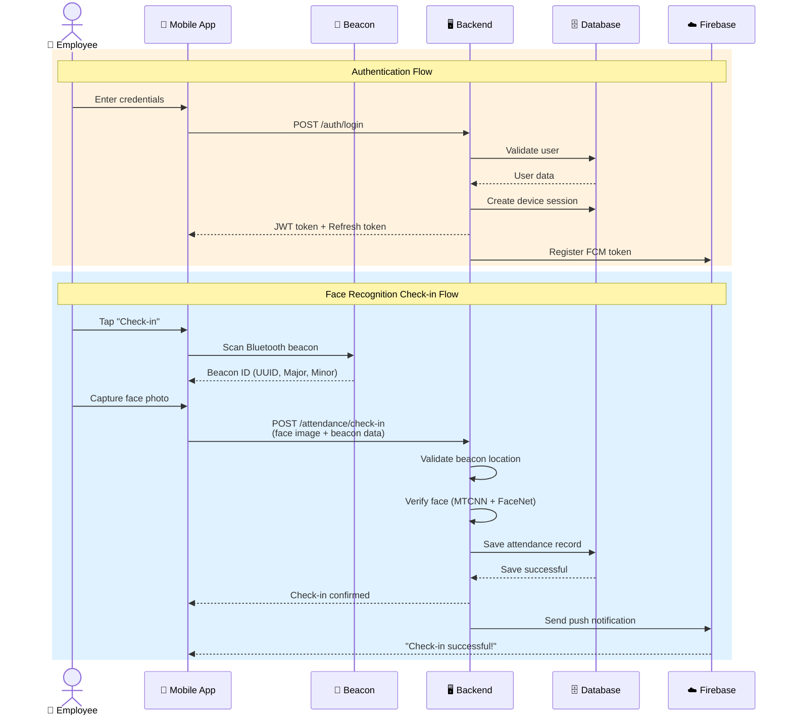
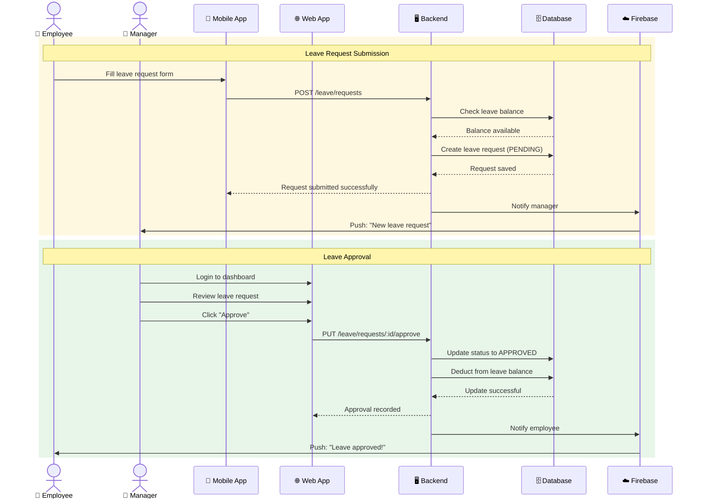
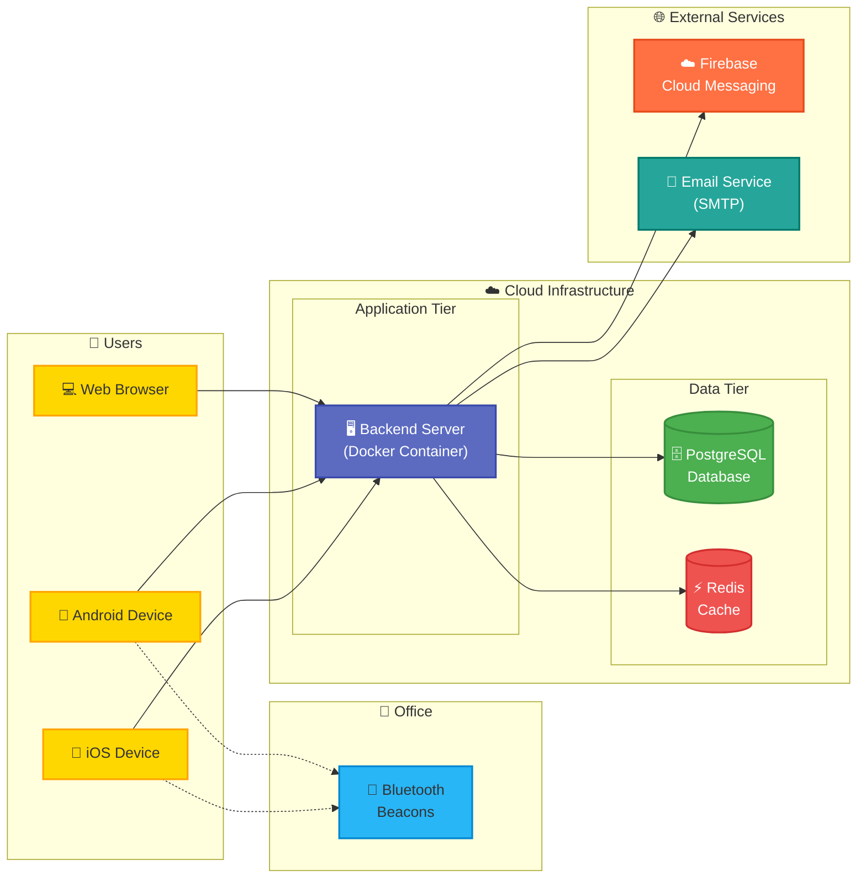
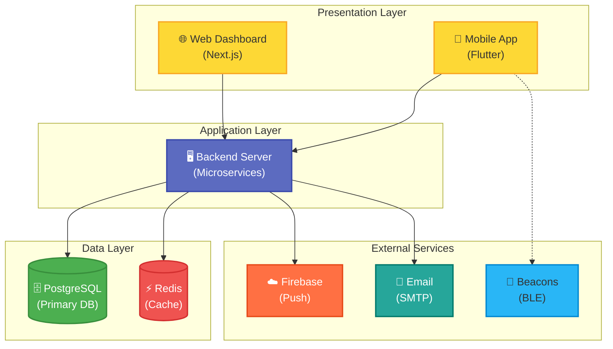

# System Architecture Diagram (Mermaid)

High-level system architecture với icons đẹp hơn PlantUML.

> **Cách xem**: 
> - Trên GitHub (tự động render)
> - VS Code: Cài extension "Markdown Preview Mermaid Support"
> - Online: https://mermaid.live (copy code vào)

---

## 1. System Architecture Overview

```mermaid
graph TB
    %% ==================== ACTORS ====================
    Employee["👤<br/><b>Employee</b><br/><i>(End User)</i>"]
    Manager["👔<br/><b>Manager</b><br/><i>(Approver)</i>"]
    Admin["⚙️<br/><b>HR Admin</b><br/><i>(Administrator)</i>"]
    
    %% ==================== CLIENT LAYER ====================
    MobileApp["📱<br/><b>Mobile App</b><br/><i>(Flutter - iOS/Android)</i>"]
    WebApp["🌐<br/><b>Web Dashboard</b><br/><i>(Next.js - React)</i>"]
    
    %% ==================== BEACONS ====================
    Beacon["📡<br/><b>Bluetooth Beacons</b><br/><i>(Office Location Validator)</i>"]
    
    %% ==================== BACKEND ====================
    Backend["🖥️<br/><b>Backend Server</b><br/><i>(Microservices Architecture)</i>"]
    
    %% ==================== DATA LAYER ====================
    Database[("🗄️<br/><b>PostgreSQL</b><br/><i>(Primary Database)</i>")]
    Redis[("⚡<br/><b>Redis</b><br/><i>(Cache Layer)</i>")]
    
    %% ==================== EXTERNAL SERVICES ====================
    FCM["☁️<br/><b>Firebase</b><br/><i>(Push Notifications)</i>"]
    Email["📧<br/><b>Email Service</b><br/><i>(SMTP Server)</i>"]
    
    %% ==================== CONNECTIONS ====================
    Employee -->|Login, Check-in<br/>Submit leave| MobileApp
    Manager -->|Approve leaves<br/>View reports| WebApp
    Admin -->|Manage employees<br/>System config| WebApp
    
    MobileApp -.->|Scan beacon<br/>(Bluetooth)| Beacon
    
    MobileApp -->|HTTPS/REST API| Backend
    WebApp -->|HTTPS/REST API| Backend
    
    Backend -->|Read/Write data| Database
    Backend -->|Cache & Sessions| Redis
    
    Backend -->|Push notifications| FCM
    Backend -->|Email notifications| Email
    
    %% ==================== STYLING ====================
    classDef userClass fill:#FFB300,stroke:#FF8F00,stroke-width:3px,color:#000
    classDef clientClass fill:#FDD835,stroke:#F9A825,stroke-width:3px,color:#000
    classDef beaconClass fill:#29B6F6,stroke:#0288D1,stroke-width:3px,color:#000
    classDef backendClass fill:#5C6BC0,stroke:#3949AB,stroke-width:3px,color:#fff
    classDef dbClass fill:#4CAF50,stroke:#388E3C,stroke-width:3px,color:#fff
    classDef cacheClass fill:#EF5350,stroke:#D32F2F,stroke-width:3px,color:#fff
    classDef externalClass fill:#FF7043,stroke:#E64A19,stroke-width:3px,color:#fff
    
    class Employee,Manager,Admin userClass
    class MobileApp,WebApp clientClass
    class Beacon beaconClass
    class Backend backendClass
    class Database dbClass
    class Redis cacheClass
    class FCM,Email externalClass
```

---

## 2. Authentication & Check-in Flow



---

## 3. Leave Request & Approval Flow



---

## 4. Deployment Architecture



---

## 5. System Layers



---

## Tổng kết

### Icons trong Mermaid:
- 👤 Employee (End User)
- 👔 Manager (Approver)
- ⚙️ HR Admin (Administrator)
- 📱 Mobile App (Flutter)
- 🌐 Web Dashboard (Next.js)
- 📡 Bluetooth Beacons
- 🖥️ Backend Server
- 🗄️ PostgreSQL Database
- ⚡ Redis Cache
- ☁️ Firebase Cloud Messaging
- 📧 Email Service
- 💻 Web Browser

### Màu sắc:
- 🟡 Yellow (#FFB300, #FDD835): Users, Client Apps
- 🔵 Blue (#29B6F6, #5C6BC0): Beacons, Backend
- 🟢 Green (#4CAF50): PostgreSQL
- 🔴 Red (#EF5350): Redis
- 🟠 Orange (#FF7043): Firebase, Email

### Ưu điểm Mermaid:
✅ Icons emoji hiển thị tốt  
✅ Syntax đơn giản hơn PlantUML  
✅ GitHub render tự động  
✅ VS Code có extension hỗ trợ  
✅ Export sang PNG/SVG dễ dàng  

### Công cụ vẽ diagram:
1. **Mermaid Live Editor**: https://mermaid.live
2. **VS Code Extension**: Markdown Preview Mermaid Support
3. **Draw.io**: Import/Export với nhiều format
4. **Lucidchart**: Professional diagramming tool
